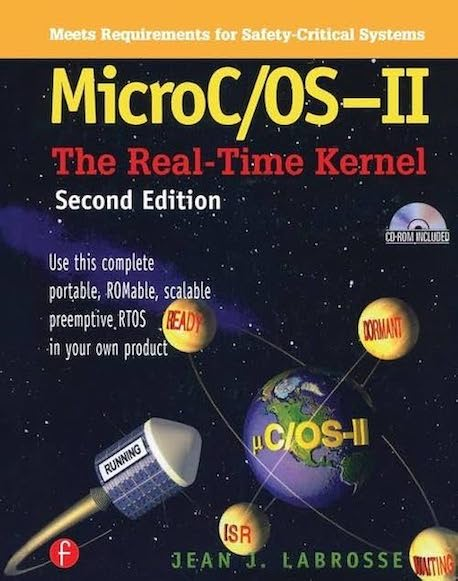

  
<h1 align="center">
  
MicroC/OS-II The Real-Time Kernel

  
</h1>
  
<b>Labrosse, Jean J. 저</b> 
CRC Press · 2002년 02월 05일 출시</b>

## :bulb: 목표

- **실시간 커널을 이해한다.**

  > MicroC/OS-II를 바탕으로, 실시간 커널의 동작원리를 이해한다.

 

## 🚩 정리한 문서 목록

 - [Real-time System Concepts](https://github.com/erectbranch/MicroC_OS-II/tree/master/ch02/summary01)

   > Background/Foreground System, Context Switch, Task States

   > Kernel, Scheduler: Round-Robin Scheduling, Non-Preemptive/Preemptive Kernels, Reentrant/Non-Reentrant Functions, Rate Monotonic Scheduling(RMS)

 - [Task Priority, Mutual Exclusion, Interrupt](https://github.com/erectbranch/MicroC_OS-II/tree/master/ch02/summary02)

   > Task Priorities: Static/Dynamic Priority, Priority Inversion, Priority Inheritance

   > Mutual Exclusion(Disabling Interrupts, Disabling Scheduling, Using Semaphores), Synchronize, Event Flag, Message Mailbox, Message Queue

   > Interrupt, Clock Tick
   
 - [Critical Section, TCB, Ready List](https://github.com/erectbranch/MicroC_OS-II/tree/master/ch03/summary01)

   > uC/OS-II File Structure, Critical Section
   
   > TCB(Task Control Block), Ready List(OSRdyGrp, OSRdyTbl, OSUnMapTbl), Operations on Ready List

 - [Task Scheduling, Initialize Task, Clock Tick](https://github.com/erectbranch/MicroC_OS-II/tree/master/ch03/summary01)

   > Task Level Context Switching, Lock/Unlocking Scheduler Interrupt Level Context Switching, 
   
   > Clock Tick, Statistics Task, Initializing OS

 - [Task Management](https://github.com/erectbranch/MicroC_OS-II/tree/master/ch04)

   > Creating, Deleting, Stack Check, Suspending, Resuming, Changing Priority, Getting Task's Information

 

## :mag: 목차

### CHAPTER 1 Getting Started with MicroC/OS-II

### CHAPTER 2 Real-time Systems Concepts

### CHAPTER 3 Kernel Structure

### CHAPTER 4 Task Management

### CHAPTER 5 Time Management

### CHAPTER 6 Event Control Blocks

### CHAPTER 7 Semaphore Management

### CHAPTER 8 Mutual Exclusion Semaphores

### CHAPTER 9 Event Flag Management

### CHAPTER 10 Message Mailbox Management

### CHAPTER 11 Message Queue Management

### CHAPTER 12 Memory Management

### CHAPTER 13 Porting MicroC/OS-II

### CHAPTER 14 80x86 Port: Real Mode, Large Model with Emulated Floating-Point Support

### CHAPTER 15 80x86 Port: Real Mode, Large Model with Hardware Floating-Point Support

### CHAPTER 16 MicroC/OS-II Reference Manual

### CHAPTER 17 MicroC/OS-II Configuration Manual

### CHAPTER 18 PC Services
