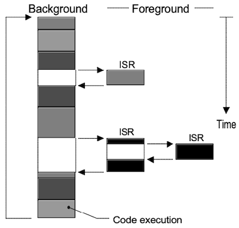
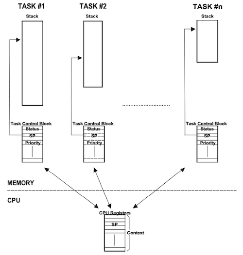
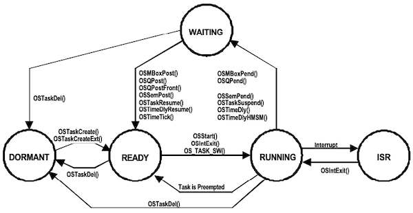
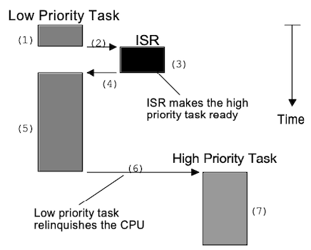
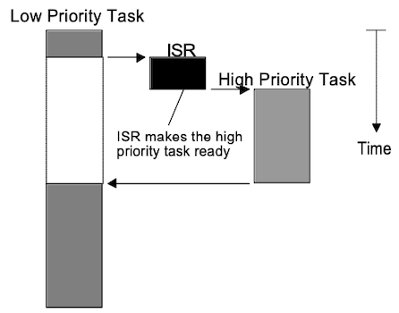

# Chapter 02 Real-time Systems Concepts

컴퓨터 시스템은 software와 hardware로 나뉘며, software는 **application software**(응용 소프트웨어)와 **system software**(시스템 소프트웨어)로 나뉜다.

> OS가 대표적인 시스템 소프트웨어이나, OS에서도 상시적으로 메모리에 적재된 소프트웨어를 주로 시스템 소프트웨어로 지칭한다.

다음은 배경지식 용도로, 자주 쓰이는 용어를 정리한 도표이다.

| 용어 | 설명 | 기타 |
| --- | --- | --- |
| **Critical Section** | interrupt가 발생하지 않아야 한다. | - 적절한 제어가 없으면, 중대한 문제가 발생할 수 있다. (e.g., data integrity broken, race condition) - **all-or-nothing** 스타일로 실행 필요 |
| **Resources** | processor, memory, devices, variables, program | |
| **Shared Resources** | 둘 이상의 task가 공유하는 자원 | |
| **Multitasking** | 여러 task가 CPU를 전환하며 사용하는 방식으로 처리 | |
| **Task** | 자기자신이 CPU를 독점하고 있다고 생각하는 프로그램 | **thread**와 동일 |

> race condition: 여러 입력 또는 실행 순서에 따라 결과가 바뀌는 상태를 의미한다.

---

## 2.1 Background/Foreground Systems

다음과 같이 foreground/background로 나뉜 단순한 시스템을 살펴보자. 하나의 반복문(loop) 안에서 여러 작업을 수행하는 이러한 구조를 **super-loop**라고 지칭한다.

> block: function or code block

> **ISR**(Interrupt Service Routine): 인터럽트가 발생했을 때 처리하는 함수(루틴)

| 용어 | 설명 | 동작 예시 |
| :---: | :--- | --- |
| **background** (task level) | while loop처럼 항상 반복되어 실행된다. | LED 버튼이 눌렸는지 체크 |
| **foreground** (interrupt level) | ISR에 따라 interrupt를 처리한다. | 버튼이 눌렸을 때, LED on |

간단한 임베디드 시스템(전자레인지, 장난감 등)에서 볼 수 있는 이러한 구현은, 저렴하지만 non-deterministic하다는 한계점을 갖는다. 

> non-deterministic: 인터럽트가 asynchronous하게 실행되므로, deadline을 보장할 수 없다. (e.g., 버튼을 계속 누르고 있으면, LED가 계속 켜지고 delay 발생)

---

## 2.2 Context Switches

멀티태스킹 커널이 다른 task로 전환하는 과정을 **context switching**이라고 한다.

- current task: context(CPU register set)를 stack에 저장한다.

- new task: context를 CPU register에 복구한 뒤 코드를 실행한다.

> 이 과정이 overhead에 해당되며, register 수가 많을수록 overhead는 커진다.

이때, 각 task는 자신만의 stack과 **Task Control Block**(TCB)라는 구조체를 가지며, TCB를 바탕으로 context를 저장한다.

> status(task 상태 정보), stack pointer, priority, CPU register 등

---

## 2.3 Task States

다음은 OS에서 task가 가질 수 있는 다섯 개 상태를 나타낸 도표이다.

| 상태 | 설명 | 함수 예시 |
| --- | --- | --- |
| Task Dormant | (수면 상태) 코드가 메모리에 있으나, 아직 멀티태스킹 커널에 등록되지 않음 | `OSTaskDel()` |
| Task Ready | (준비 상태) 언제든지 실행이 가능하도록 준비된 상태이나, 우선순위가 더 높은 다른 task가 동작 중 | `OSTaskCreate()`, `OSTaskCreateExt()`, `OSMBoxPost()`, `OSTaskResume()` ... |
| Task Running | (실행 상태) CPU를 점유하고 실행 중인 상태 | `OSStart()`, `OS_TASK_SW()`, `OSIntExit()` |
| Task Waiting | (대기 상태) I/O 처리, 공유자원 잠금, 타이머 등을 기다리는 상태 | `OSTimeDly()`, `OSMBoxPend()`, ... |
| ISR Running | ISR을 수행 중인 상태 | |

---

## 2.4 Kernels

**kernel**(커널)이란 멀티태스킹 시스템의 핵심으로, task 관리 및 task 사이의 통신을 책임지며, context switching을 수행한다.

| 장/단점 | 요소 | 설명 |
| :---: | --- | --- |
| (+) | 시스템 디자인을 단순화 | task를 분리하여, application을 단순화한다. |
| (-) | ROM 사용량 | 커널 코드가 차지하는 메모리 |
| (-) | RAM 사용량 | 커널의 데이터 구조체가 차지하는 메모리 |
| (-) | CPU time | 대체로 2~5%의 CPU 시간을 소비한다. |

> 특히 task마다 각자 stack을 차지하면서, RAM 사용량이 크게 증가한다.

> 근래 OS에서는, 커널이 file system, network protocol 등 다양한 기능을 포괄한다.

---

## 2.5 Schedulers

**scheduler**(=dispatcher)는 커널의 일부분으로, 다음에 실행할 task를 결정한다. 

- real-time kernel: 주로 우선순위 기반 스케줄링을 사용한다.

  > deadline: 특정 프로세스가 반드시 끝나야 하는 기한을 의미한다. 

- **Round-Robin Scheduling**

  둘 이상의 같은 우선순위 task가 있을 때, 동일한 시각 조각(quantom, time slice)으로 공평하게 실행하는 정책.

  > MicroC/OS-II의 각 task는 고유한 우선순위를 가져야 하므로, Round-Robin Scheduling을 지원하지 않는다.

---

### 2.5.1 Non-Preemptive vs Preemptive Kernels

우선순위 기반 스케줄링은 CPU 자원의 선점 방식(스케줄링)에 따라서, **non-preemptive**(=cooperative multitasking, 비선점형)과 **preemptive**(선점형) 두 커널로 분류할 수 있다.

> 비선점형: task 스스로 제어권을 넘기기 전까지 선점. Windows 3.1, MS-DOS 등이 대표적. e.g., `while(msg=GetMessage(&msg, NULL, 0, 0)) { DispatchMessage(&msg); }`

|| Non-Preemptive(비선점형) | Preemptive(선점형) |
| :---: | :---: | :---: |
||  |  |
|| 저-우선순위 task 마무리 후, 비로소 context switching 발생 | ISR 직후 context switching 발생 |

다음은 두 종류의 커널의 장단점을 나타낸 도표이다.

|| Non-Preemptive | Preemptive |
| :---: | --- | --- |
| (+) | - 짧은 inturrupt latency - non reentrant function 사용 가능 - 데이터 손상에서 안전(세마포어 등 필요 감소) | - deterministic |
| (-) | - responsiveness(응답성) | - 세마포어 등 프로그래밍 노력 필요 |

---

#### 2.5.1.1 Reentrant vs Non-Reentrant Functions

특정 함수를 사용할 때 데이터의 손상 가능성(reentrancy)에 따라서, 함수를 **reentrant**와 **non-reentrant** 두 가지로 분류할 수 있다.

|| reentrant(재진입 가능) | non-reentrant(비재진입) |
| :---: | --- | --- |
| e.g. | `void strcpy(char *dest, char *src)` `{`  $\quad$ `while (*dest++ = *src++)  {`  $\quad \quad$ `;`  $\quad$ `}`  $\quad$ `*dest = NUL;`  `}` | `int Temp;    // 정수형 전역변수`  `void swap(int *x, int *y)`  `{`   $\quad$ `Temp = *x;`  $\quad$ `*x = *y;`  $\quad$ `*y = Temp;`  `}` |
| | 복사본이 각 task stack에 위치하므로, **인자가 손상되지 않는다.** | **인자가 전역 변수를 바꾸면서**, 다른 task에서 문제가 발생할 수 있다. |

---

### 2.5.2 Rate Monotonic Scheduling(RMS)

**RMS**(Rate Monotonic Scheduling)은, task의 rate(실행 빈도, **short period**)를 기반으로, 우선순위를 배정하는 스케줄링 기법이다. 다음은 RMS에서 두는 세 가지 가정이다.

- (1) 모든 task는 주기적(periodic)이다.

- (2) task가 서로 동기화하지 않고, 자원을 공유하지 않으며, 데이터를 주고 받지 않는다. (세마포어 등을 사용하지 않음)

- (3) 항상 task ready의 최상위 우선순위 task가 실행된다. (preemptive)

참고로 RMS는 다음 식이 만족할 때, <U>hard real-time system(deadline miss가 발생하지 않는 시스템)을 보장</U>한다.

$$U = \sum_i {{E_i} \over {T_i}} \le n (2^{1/n}-1)$$

- $E_i$ : task i 최대 실행 시간

- $T_i$ : task i 실행 주기

- $U$ : CPU Utilization(모든 task의 CPU 사용률: 개별 실행 시간/주기의 총합)

---
