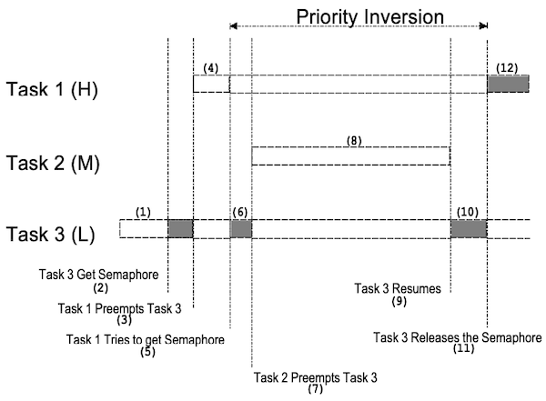
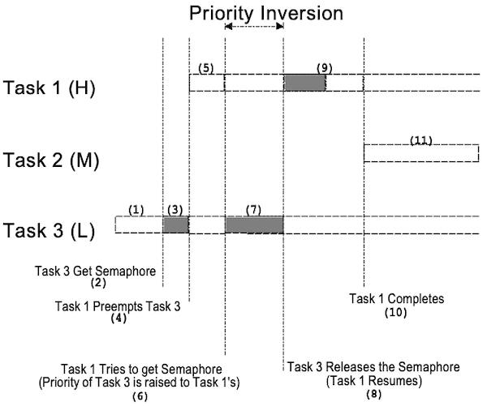
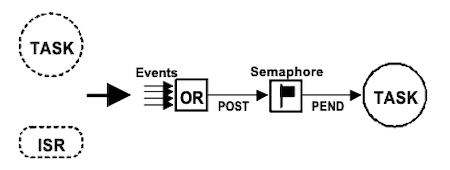
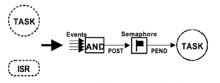
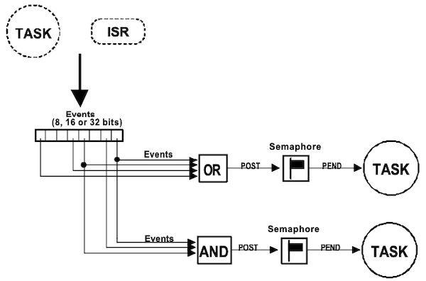
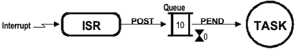
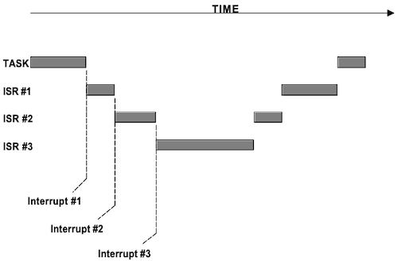
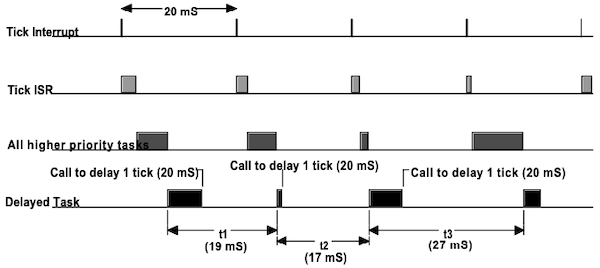
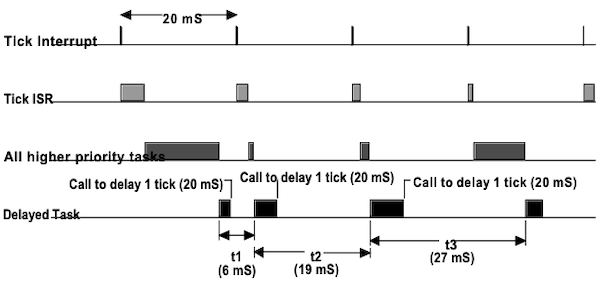
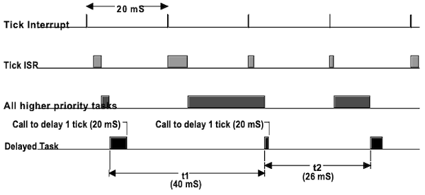

# Chapter 02 Real-time Systems Concepts

---

## 2.6 Task Priorities

application 실행 중 task 우선순위를 수정할 수 있는지 여부에 따라서, 우선순위를 두 가지 종류로 분류할 수 있다.

|| static priority | dynamic priority |
| --- | :---: | :---: |
| 우선순위 배정 | 컴파일 단계에서 정적 우선순위 배정 | task 실행 도중 우선순위 변경 가능 |
| 주된 사용처 | Real-Time OS(RTOS) | General-Purpose OS(GPOS) |
| 장점 | 컴파일 단계에서 모든 task의 deadline 결정 | priority inversion 방지 |

---

### 2.6.1 Priority Inversion

**priority inversion**(우선순위 전도)란, 높은 우선순위 task가 낮은 우선순위 task를 대기하는 현상을 의미한다.

> 주로 real-time kernel에서 발생하는 문제에 해당된다.

다음은 3가지 고/중/저 우선순위 task의 실행 과정에서, 우선순위 전도가 발생한 예시다.

> H, M, L: High, Medium, Low priority


| |  |
| :---: | --- |
||  |
| (1) | `task 3`(L) 실행 중 (`task 1`(H), `task 2`(M): 이벤트 대기) |
| (2) | `task 3`: shared resource 엑세스하기 위해 세마포어 획득 |
| (3) | `task 3`: 해당 자원에 어떠한 작업 수행 |
| (4) | `task 3`에서 (타이머 인터럽트 등 이벤트 발생하여) `task 1`으로 context switching |
| (5) |  |
| (6) | `task 1`: `task 3`이 소유한 자원에 접근하기 위해 세마포어 획득 시도<br/> 하지만, 현재 `task 3`이 소유하고 있으므로 `task 1`를 중단하고 세마포어 대기 리스트에 `task 1`을 등록 |
| (7) |  |
| (8) | `task 3` 재실행<br/>하지만, `task 2`가 기다리는 이벤트 발생하여 `task 2` 실행 |
| (9) |  |
| (10) | `task 2`: 이벤트 처리<br/>끝나고, `task 3`에게 CPU를 반납 |
| (11) |  |
| (12) | `task 3`: 작업을 끝내고 세마포어 해제<br/>커널이 세마포어를 기다리는 고-우선순위 `task 1`을 발견하고 context switching |
| (13) | `task 1`: shared resource에 접근하여 작업 수행 |

고-우선순위의 `task 1`이 낮은 우선순위인 task 3을 기다리게 되며, 도중에 `task 2`가 끼어들면서 실행이 더욱 지연되는 문제가 발생한다.

---

### 2.6.2 Priority Inheritance

이러한 우선순위 전도 문제를 해결하기 위해, **priority inheritance**(우선순위 상속)을 사용한다.

| | |
| :---: | --- |
| |  |
| (1) | `task 3`(L) 실행 중 (`task 1`(H), `task 2`(M): 이벤트 대기) |
| (2) | task 3: shared resource를 엑세스하기 위해, **mutual-exclusion**(상호배제) 세마포어 획득 |
| (3) | |
| (4) | `task 3`이 자원을 엑세스하는 동안, `task 1`으로 context switching |
| (5) | |
| (6) | `task 1`: mutex 획득 시도<br/>**`task 3` 우선순위를 `task 1` 우선순위 수준으로 높인다.** |
| (7) | `task 1`을 뮤텍스 대기 목록에 올린 뒤, `task 3` 재실행 
| (8) | `task 3`: 자원 사용이 끝나면 뮤텍스를 양도<br/>커널은 **`task 3` 우선순위를 원래 값으로 복구한다.** |
| (9) | |
| (10) | |
| (11) | `task 1`이 일을 마무리하고, `task 2`로 context switching |

---

## 2.7 Mutual Exclusion

서로 다른 task가 자원을 공유하는 경우, 데이터 손상을 막기 위해 task가 해당 자원을 독점할 필요가 있다.

> 공유하는 자원 e.g.,: 단일 address space를 공유하는 전역 변수, 포인터, 버퍼, 링크드 리스트 등

이때, 공유 불가능한 자원을 동시에 피하기 위한 알고리즘을 **mutual exclusion**(상호배제)으로 지칭하며, all-or-nothing 스타일(atomic execution)로 동작한다. 

mutual exclusion은 대표적으로 다음 세 가지 방식으로 구현이 가능하다.

- Disabling Interrupts (kernel-level)

- Disabling Scheduling (kernel-level)

- Using Semaphores (application-level)

---

### 2.7.1 Disabling Interrupts

MicroC/OS-II에서는, 인터럽트를 비활성화/재활성화할 수 있는 매크로(`OS_ENTER_CRITICAL`, `OS_EXIT_CRITICAL`)를 제공한다.

> 내부 코드가 길어질수록, interrupt latency가 증가하므로 주의

```c
void Function (void)
{
    OS_ENTER_CRITICAL();
    // 
    OS_EXIT_CRITICAL();
}
```

---

### 2.7.2 Disabling Scheduling

task가 변수나 데이터 구조체를 ISR와 공유하지 않을 경우, 스케줄링을 비활성화하는 방안도 있다.

- 스케줄러가 lock된 상태에서도, 인터럽트는 여전히 동작한다.

```c
void Function (void)
{
    OSSchedLock();
    // 
    OSSchedUnlock();
}
```

---

### 2.7.3 Using Semaphores

**semaphore**(세마포어)는 대부분의 멀티태스킹 커널이 제공하는 프로토콜로, 코드를 계속 실행하기 위해서 획득해야 하는 열쇠이다. 

> 참고로 세마포어는 3가지 용도로 활용된다. mutual exclusion(shared resource 접근 제어), signaling(이벤트 발생 알림), synchronization(두 task 사이의 동기화 구현)

만약 다른 task가 이미 세마포어를 사용하고 있다면, 실행 중인 task는 양도를 받기 전까지 대기 상태로 전환된다. 세마포어는 정수 변수이며 다음과 같이 동작한다.(초기값: 1)

- `semaphore > 0`: 자원에 접근하고 세마포어의 값을 1 감소시킨다. 

- `semaphore = 0`:  대기 상태로 전환된다. 

- task가 작업을 마치면 세마포어 값을 1 증가시킨다. (semaphore + 1)

```c
OS_EVENT *ShareDataSem; // 세마포어 변수

void Function (void)
{
    INT8U err;
 
    OSSemPend(ShareDataSem, 0, &err); // 값을 하나 줄임

    /* shared data에 접근 가능 */
     
    OSSemPost(ShareDataSem);  // 값을 하나 늘림
}
```

---

#### 2.7.3.1 Deadlock

**deadlock**(교착 상태)란, 서로 다른 두 task가 서로의 자원을 무한정 기다리는 상황을 의미한다. 

> 임베디드 시스템보다, 큰 규모의 멀티테스킹 시스템에서 많이 발생

- 대부분의 커널은 **timeout**을 활용하여 deadlock 방지한다.

- 별도의 deadlock avoidance 알고리즘을 두어, semaphore 취득/반납 상태를 관찰 및 관리한다.

(생략)

---

## 2.8 Synchronization

세마포어는 **synchronization**(동기화) 도구로 사용할 수 있다. 세마포어를 활용해 동기화를 수행하는 과정을 나타낸 그림이다.

> 세마포어를 동기화 용도로 활용 시 깃발로 표시한다. (mutual exclusion: 열쇠 표시)

| Task-ISR | Task-Task |
| :---: | :---: |
|  |  |

```c
void Task1(void *pdata)
{
    for (;;) {
        Perform operation;
        Signal task #2;
        Wait for signal from task #2;
        Continue operation;
    }
}

void Task2(void *pdata)
{
    for (;;) {
        Perform operation;
        Signal task #1;
        Wait for signal from task 1;
        Continue operation;
    }
}
```

---

## 2.9 Event Flags

**event flag**는 task를 여러 이벤트가 발생하는 상황에서 동기화하기 위해 사용한다. 다음은 event flag를 활용한 두 가지 동기화 방법이다.

| disjunctive(or) | conjunctive(and) |
| :---: | :---: |
|  |  |
| 임의의 이벤트 하나가 발생했을 경우 동기화 | 모든 이벤트가 발생했을 경우 동기화 |

> or: 키보드 인터럽트 등

각 이벤트를 1-bit로 나타내며(그룹: 8, 16, 32 bits 등 크기 다양), 커널에서 이를 제어하기 위한 `SET`, `CLEAR`, `WAIT` 서비스를 제공한다.



---

## 2.10 Message Mailboxes

커널 서비스를 활용하여 task에 메시지(포인터)를 송부할 수 있다.


- 빈 메일박스(포인터 사이즈 변수)를 기다리는 task는, 수신 전까지 대기 상태로 전환된다.

  이때, PEND timeout을 명시한다.

메시지가 제 시간 안에 도착하는가 여부에 따라, 다음 두 가지로 실행이 나뉘게 된다.

- 메시지가 도착하면 task는 메시지를 수신하고, 실행 준비 상태로 전환된다.

  - 우선순위 기반: 메시지를 기다린 최상위 우선순위 task로 전달

  - FIFO 기반: 메시지를 기다린 순서대로 전달

  > MicroC/OS-II는 우선순위 기반만 지원한다.

- timeout 시간까지 도착하지 않으면, 다시 해당 task가 실행 준비 상태로 전환되며, 에러 코드가 전달된다. 

---

## 2.11 Message Queue



(생략)

---

## 2.12 Interrupts

**interrupt**란, asynchronous한 이벤트가 발생한 사실을 CPU에게 알리는 하드웨어 메커니즘이다. CPU는 context를 저장하고, ISR(Interrupt Service Routine)이라는 특수한 서브루틴으로 점프한다.

ISR 종료 시, 정책에 따라서 다음 중 하나로 return한다.

| system | return |
| :---: | :---: |
| background/foreground | background process |
| non-preemptive | 인터럽트된 task |
| preemptive | 가장 높은 우선순위 task |

이때, 다음과 같이 인터럽트는 중첩되어 실행될 수 있다.(**interrupt nesting**)



- **interrupt latency**: 인터럽트가 비활성화된 최대 시간 + ISR에서 최초 명령을 실행하는 시간

---

### 2.12.1 Clock Tick

**clock tick**은 정기적으로 일어나는 특수한 인터럽트로, 타이머 인터럽트가 발생할 때마다 1씩 증가하는 전역 변수로 관리된다. 이를 통해 task를 지연시키거나 timeout을 설정할 수 있다.

```c
// 예시
#define OS_TICKS_PER_SEC 100
```

하지만 주의할 점으로, **tick delay는 정확하게 작동하지 않는다.** 다음은 1 tick을 20 ms로 설정한 시스템에서, delay가 정확하지 않게 작동하는 세 가지 예시다.

> notation: HPT(High-Priority Task), LPT(Low-Priority Task)

| case 1 |
| :---: |
| HPT와 ISR가, 1 tick 지연시킨 task보다 먼저 수행됨 |
|  |
| **case 2** |
| HPT와 ISR가, 1 tick보다 짧은 시간 잠시 수행됨 |
|  |
| **case 3** |
| HPT와 ISR이 1 tick을 초과하여 실행 |
|  |

> case 2: 1 tick delay는 사실상 즉시 다시 실행된다. 이러한 현상을 고려하여 delay는, 의도한 tick보다 +1 추가한 값으로 설정하는 것이 바람직하다.

> case 3: 주로 CPU 부하나 설계 오류로 인해 발생하고, 설정한 delay보다 늦게 실행되는 문제가 발생한다.

---

## 2.13 Memory Requirements

foreground/background 시스템이라면, 메모리 사용량은 전적으로 application에 달려 있다. 하지만, 멀티태스킹 커널을 사용할 경우, 커널이 차지하는 크기가 여러 가지 요인에 따라 달라지게 된다.

| memory size | factors |
| --- | --- | 
| Code Size(ROM) | kernel code size + task code size |
| Data Size(RAM) | kernel data size + task data size + task/ISR stack size |

> 단, `const global` 변수는 flash ro(read-only) section에 저장된다.

---
