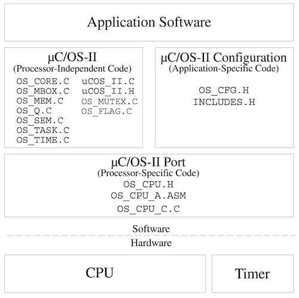
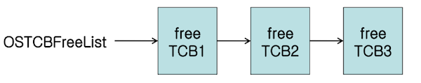
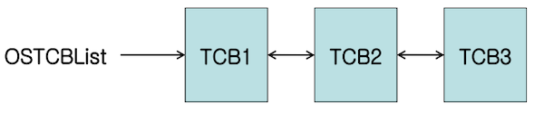
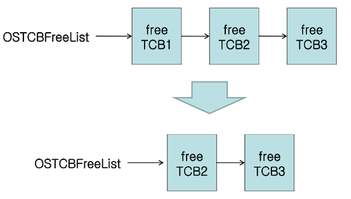
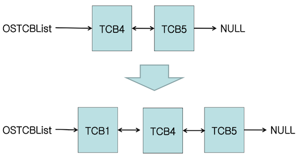
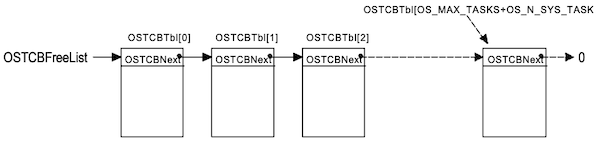
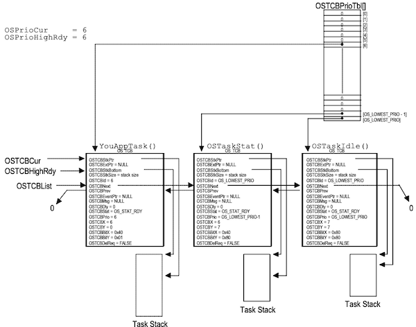
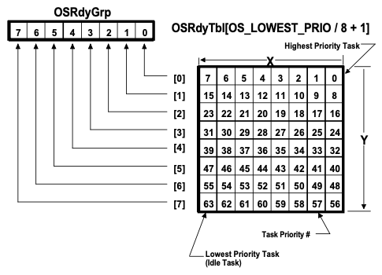
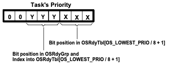
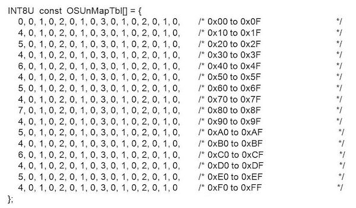

# Chapter 03 Kernel Structure

---

## 3.1 uC/OS-II File Structure

MicroC/OS-II는 다음과 같은 file structure로 구성된다.



| | | |
| --- | --- | --- |
| **uC/OS-II** | OS 핵심 | processor-independent |
| **uC-OS-II Configuration** | config 헤더 파일 | application-specific |
| **uC/OS-II Port** | context switching 관련 | processor-specific |

> 가령 target CPU가 바뀔 경우, uC/OS-II Port를 수정하면 된다.

---

## 3.2 Critical Sections

MicroC/OS-II에서는 인터럽트를 활성화/비활성화할 수 있는 2가지 매크로를 제공한다. (**critical sections**) 

- `OS_ENTER_CRITICAL()`

- `OS_EXIT_CRITICAL()`

주의할 점으로 인터럽트가 비활성화 상태일 때, 일부 함수를 호출하면 시스템이 멈출 수 있다. 예를 들어, `OSTimeDly()`은 인터럽트가 비활성화 상태이므로, 타임 틱 인터럽트가 발생할 수 없어서 문제가 발생한다.

> 주로 지연(PEND) 관련된 함수는 모두 이런 문제를 가진다. 대부분의 uC/OS-II 서비스는 인터럽트가 활성화 상태일 때 호출해야 한다.

---

### 3.2.1 OS_CRITICAL_METHOD

critical section은 크게 세 가지 방식으로 구현할 수 있으며, 프로세서 및 컴파일러에 따라서 알맞은 방식을 선택해야 한다.(`OS_CPU.H`에 정의된 `OS_CRITICAL_METHOD` 상수에 알맞은 값을 지정하는 방식으로 선택)

| | OS_CRITICAL_METHOD == 1 | OS_CRITICAL_METHOD == 2 | OS_CRITICAL_METHOD == 3 |
| --- | --- | --- | --- |
| disable | `#define OS_ENTER_CRITICAL() asm("DI")` | `#define OS_ENTER_CRITICAL() asm("PUSH PSW"); asm("DI")` | `#define OS_ENTER_CRITICAL()`<br/> $\quad$ `cpu_sr = get_processor_psw();`<br/>  $\quad$ `disable_interrupts();` |
| enable | `#define OS_EXIT_CRITICAL() asm("EI")` | `#define OS_EXIT_CRITICAL() asm("POP PSW")` | `#define OS_EXIT_CRITICAL()` <br/> $\quad$ `set_processor_psw(cpu_sr);` |
| interrupt status | 보존 X | stack 사용하여 보존  | 지역 변수 사용하여 보존 |

> `asm`: inline assembly로 C code에서 assembly를 삽입하는 문법에 해당된다. (c 컴파일러에 따라서 문법은 다를 수 있다.)

**PSW**(Processor Status Word)는 interrupt status 정보를 담으며, interrupt enable/disable, supervisor/user mode 등의 status flag를 갖는다.

> `asm("EI")`를 할 필요가 없는 이유: `asm("POP PSW")` 과정에서 interrupt enable bit이 복원되기 때문

---

## 3.3 Tasks = Infinite Loop

task는 기본적으로 다음과 같이 무한루프 형태로 설계한다.

```c
void YourTask (void *pdata)
{
  for (;;) {
    /* USER CODE */
    Call one of uC/OS-II services:
    OSFlagPend();
    OSMboxPend();
    OSMutexPend();
    OSQPend();
    OSSemPend();
    OSTaskDel(OS_PRIO_SELF);
    OSTaskSuspend(OS_PRIO_SELF);
    OSTimeDly();
    OSTimeDlyHMSM();
    /* USER CODE */
  }
}
```

---

## 3.4 Task Control Block: OS_TCB

task가 생성할 때, 각 task마다 **TCB**(Task Control Block)가 할당된다.(`OS_TCBInit()`) TCB는 task의 상태를 담고 있는 `OS_TCB` 구조체 형태로 RAM에 **reside**(상주)한다.

> reside: physically exist (c.f., 반례로 virtual memory는 swap되어 사라질 수 있고, 따라서 reside하지 않음)

> `OS_TCBInit()`: `OSTaskCreate()`나 `OSTaskCreateExt()` 함수에서 호출된다.

`OS_TCB` 구조체는 다음과 같이 doubled linked list 형태로 구현된다.

| | |
| :---: | :---: |
| `OSTCBFreeList` |  |
| `OSTCBList` |  |

다음은 `OS_TCBInit()`이 호출되었을 때, doubled linked list가 변화하는 과정을 나타낸 도식이다. 예시에서는 `OSTCBFreeList`에서 TCB 1을 꺼내 `OSTCBList`에 추가한다.(task가 삭제될 경우, 다시 `OSTCBFreeList`에 추가된다.)

| | |
| :---: | :---: |
| `OSTCBFreeList` |  |
| `OSTCBList` |  |

이때, linked list는 다음과 같은 포인터를 기반으로 관리된다.



---

### 3.4.1 typedef struct os_tcb

다음은 `OS_TCB` 구조체의 구성을 나타낸 도식이다. 

- `OSTCBHighRdy`: 가장 높은 우선순위

- `OSTCBCur`: 현재 실행 중인 task



| 주요 변수 | 설명 | 특이사항 |
| --- | --- | --- |
| `OSTCBStkPtr` | 스택 꼭대기를 가리키는 포인터 | context swiching 어셈블리에서, 유일하게 접근하는 필드 |
| `OSTCBStat` | task 상태 | ucos.c 내 정의 |
| `OSTCBDly` | task delay | `OSTimeDly(t)`에서 t가 기록되고, 1씩 감소된다.<br/>(0이 되면 waiting에서 ready로 전환)  |
| `OSTCBPrio` | task 우선순위 | 0(최상위)~63(최하위) |
| `OSTCBX`, `OSTCBY`, `OSTCBBitX`, `OSTCBBitY` | 우선순위 관리 | 3.5절 참조 |
| `OSTCBNext`, `OSTCBPrev` | linked list | 3.4절 참조 |
| `OSTCBEventPtr` | ECB(Event Control Block)를 가리키는 포인터 | |

다음은 `OS_TCB` 구조체를 정의한 코드이다.

> unsigned int8로 정의된 state에 주목하자.

```c
typedef struct os_tcb {
  OS_STK *OSTCBStkPtr;          /* Pointer to current top of stack */

// EXT: 확장 기능(extension)을 의미하며, 반드시 존재할 필요는 없다. 
#if OS_TASK_CREATE_EXT_EN > 0 
  void *OSTCBExtPtr;           /* Pointer to user definable data for TCB extension*/
  OS_STK *OSTCBStkBottom;      /* Pointer to bottom of stack */
  INT32U OSTCBStkSize;         /* Size of stack (in number of stack elements) */
  INT16U OSTCBOpt;             /* Task options */
  INT16U OSTCBId;              /* Task ID (0..65535) */
#endif

  struct os_tcb *OSTCBNext;    /* Pointer to next TCB in the TCB list */
  struct os_tcb *OSTCBPrev;    /* Pointer to previous TCB in the TCB list */

#if ((OS_Q_EN > 0) && (OS_MAX_QS > 0)) || (OS_MBOX_EN > 0) || (OS_SEM_EN > 0) || (OS_MUTEX_EN > 0)
  OS_EVENT *OSTCBEventPtr;     /* Pointer to event control block */
#endif

#if ((OS_Q_EN > 0) && (OS_MAX_QS > 0)) || (OS_MBOX_EN > 0)
  void *OSTCBMsg;              /* Message received from OSMboxPost() or OSQPend() */
#endif

#if (OS_VERSION >= 251) && (OS_FLAG_EN > 0) && (OS_MAX_FLAGS > 0)
#if OS_TASK_DEL_EN > 0
  OS_FLAG_NODE *OSTCBFlagNode;  /* Pointer to event flag node */
#endif
  OS_FLAGS OSTCBFlagsRdy;       /* Event flags that made task ready */
#endif

  INT16U OSTCBDly;              /* Nbr ticks to delay task */
  INT8U OSTCBStat;              /* Task status */
  INT8U OSTCBPrio;              /* Task priority */

  INT8U OSTCBX;                 /* Bit position in group  */
  INT8U OSTCBY;                 /* Index into ready table */
  INT8U OSTCBBitX;              /* Bit mask position in group */
  INT8U OSTCBBitY;              /* Bit mask position in ready table */

#if OS_TASK_DEL_EN > 0
  BOOLEAN OSTCBDelReq;            /* Indicates whether a task needs to delete itself */ 
#endif
} OS_TCB;
```

---

### 3.4.2 OS_TCBInit()

`OS_TCB`를 생성하는 `OS_TCBInit()` 초기화 함수는, 다음과 같은 7개 인자를 필요로 한다.

| 인자 | 설명 | 저장되는 필드 |
| --- | --- | --- | 
| INT8U prio | task 우선순위 | `OSTCBPrio` |
| OS_STK \*ptos | task stack의 top을 가리키는 포인터 | `OSTCBStkPtr` |
| OS_STK \*pbos | task stack의 bottom을 가리키는 포인터 | `OSTCBStkBottom` |
| INT16U id | task id | `OSTCBId` |
| INT32U stk_size | task stack 크기 | `OSTCBStkSize` |
| void \*pext | 사용자 정의 TCB(확장)을 가리키는 포인터 | `OSTCBExtPtr` |
| INT16U opt | task 옵션 | `OSTCBOpt` |

---

### 3.4.3 OSTCBStat

다음은 `OSTCBStat`가 나타내는 task status를 정리한 도표이다.

| bits | status | description |
| --- | --- | --- | 
| 0x00 | OS_STAT_RDY (=0x00) | Task Ready |
| 0x01 | OS_STAT_SEM | Pending on semaphore |
| 0x02 | OS_STAT_MBOX | Pending on mailbox |
| 0x04 | OS_STAT_Q | Pending on queue
| 0x08 | OS_STAT_SUSPEND | Task is suspended |
| 0x10 | OS_STAT_MUTEX | Pending on mutual exclusion semaphore |
| 0x20 | OS_STAT_FLAG | Pending on event flag group |
| 0x3E | OS_STAT_PEND_ANY | (OS_STAT_SEM \| OS_STAT_MBOX \| OS_STAT_Q \| OS_STAT_MUTEX \| OS_STAT_FLAG) |

---

## 3.5 Ready List

uC/OS-II에서는 현재 Task Ready인 task를 **Ready List**에 기록하여 관리한다. Ready List는 두 가지 자료구조를 기반으로 한다.

- `INT8U OSRdyGrp`: 한 그룹이 8개 우선순위 task에 대응되며, 그룹에서 적어도 하나의 Task Ready가 있다면 flag가 켜진다.

- `INT8U OSRdyTbl[8]`: 각 task가 Task Ready인지 표시



우선순위는 6bits로 표현하는데, 상위 3bit는 `OSRdyGrp`, 하위 3bit는 `OSRdyTbl`을 조회하기 위해 사용한다.

> 상위 3비트(Y): `prio >> 3`, 하위 3비트(X): `prio & 0x07`로 획득 (0x07 = 0000 0111)



---

### 3.5.1 OSMapTbl[]

Ready List를 조작하는 과정을 살펴보자. 이때, 우선순위 각 3 bit마다, `OSMapTbl[]`에서 대응되는 bitmask 값을 가져온다.

| Index | Bit mask(binary) |
| :---: | :---: |
| 0 | 0000 0001 |
| 1 | 0000 0010 |
| 2 | 0000 0100 |
| 3 | 0000 1000 |
| 4 | 0001 0000 |
| 5 | 0010 0000 |
| 6 | 0100 0000 |
| 7 | 1000 0000 |

예를 들어. Priority `0001 1010`(=26)인 task가 있다면, bitmask 값은 다음과 같다.

|  | Y<br/>(`OSRdyGrp`) | X<br/>(`OSRdyTbl[Y]`) |
| :---: | :---: | :---: |
| `0001 1010` | `011`(=3) | `010`(=2) |
| `OSMapTbl[]` | BitY: `0000 1000` | BitX: `0000 0100` |

---

### 3.5.2 Operations on Ready List

다음은 이를 기반으로 Ready List를 조작하는 예시다.

> `|=`:  bitwise OR 결과를 할당

> 제거 시 주의사항으로, `OSRdyTbl` 행의 값(그룹)이 모두 0이 됐을 때, `OSRdyGrp` flag를 끈다.

| operation | 코드 | 설명 |
| --- | --- | --- |
| Task Ready 상태로 전환 | `OSRdyGrp    \|= OSMapTbl[prio >> 3];`<br/>`OSRdyTbl[prio >> 3]   \|= OSMapTbl[prio & 0x07];` | `OSRdyGrp  \|= BitY`<br/>`OSRdyTbl[Y] \|= BitX` |
| Ready List에서 제거 | `if ((OSRdyTbl[prio >> 3] &= ~OSMapTbl[prio & 0x07]) == 0)`<br/> $\quad$ `OSRdyGrp &= ~OSMapTbl[prio >> 3];` | `if((OSRdyTbl[Y] &= ~BitX) == 0)`<br/> $\quad$ `OSRdyGrp &= ~BitY` |

또한, 후술할 `OSUnMapTbl`을 활용해, 최고 우선순위 task를 빠르게 조회할 수 있다.

| operation | 코드 | 설명 |
| --- | --- | --- |
| 최고 우선순위 task 조회 | `y = OSUnMapTbl[OSRdyGrp];`<br/>`x = OSUnMapTbl[OSRdyTbl[y]];`<br/>`prio = (y << 3) + x;` | `y = OSRdyGrp` 대응<br/>`x = OSRdyTbl[y]` 대응 |

---

### 3.5.3 Finding the Highest Priority Task: OSUnMapTbl[]

(context switching 시) 가장 높은 우선순위 task를 찾을 때는, `OSUnMapTbl`을 활용하여 빠르게 조회한다.



다음은 `OSRdyGrp`가 현재 `0110 1000`(=0x68) 때, 최고 우선순위 task를 찾는 예시다.

```c
y = OSUnMapTbl[0x68] = 3 
x = OSUnMapTbl[0xE4] = 2 
prio = (y << 3) + x = (3 << 3) + 2 = 26
```

---
