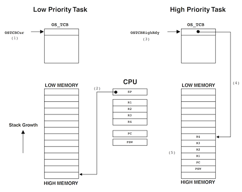
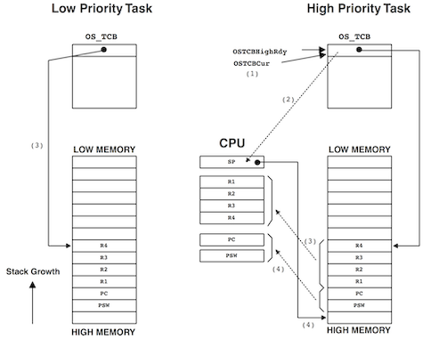
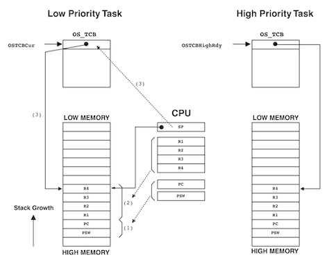
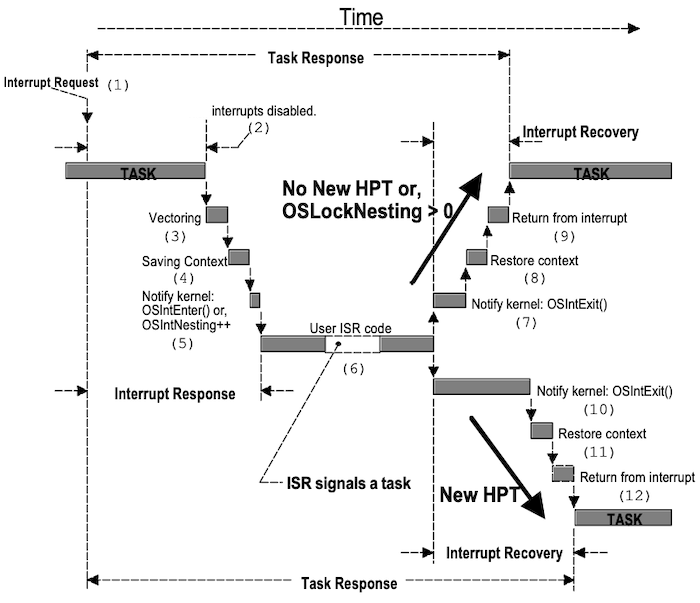
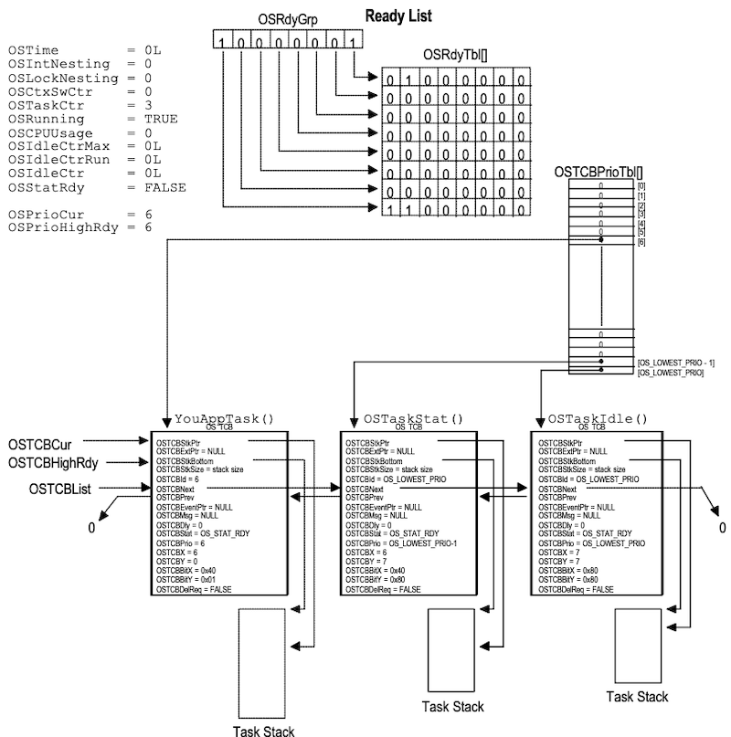
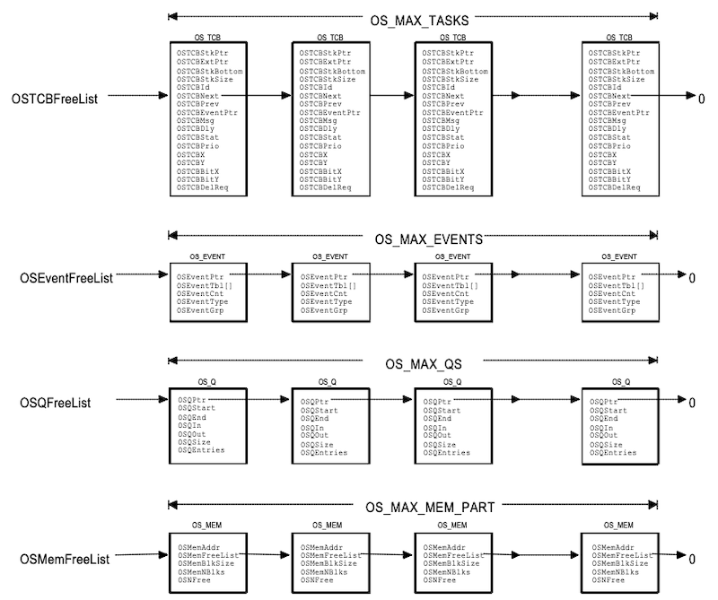

# Chapter 03 Kernel Structure

- task-level scheduling: `OS_Sched()`

  소프트웨어 인터럽트 명령어나, (프로세서에 따라) TRAP 명령어에 의해 호출된다.

- ISR-level scheduling: `OSIntExit()`

---

## 3.6 Task Level Context Switching: OS_Sched()

task 수준에서 context switching을 수행하는 `OS_Sched()` 함수를 살펴보자. 다음은 `OS_Sched()`에서 활용되는 주요 변수와 함수이다.

| 주요 변수/함수 | 설명 | 특이사항 |
| --- | --- | --- |
| `OSPrioHighRdy` | 가장 높은 우선순위 | `OSRdyGrp`, `OSRdyTbl`을 활용하여 계산 |
| `OSTCBHighRdy` | 가장 높은 우선순위 task의 TCB | `OSTCBPrioTbl` 통해 획득 |
| `OSTCBCur` | 현재 실행중인 task의 TCB | |
| `OSIntNesting`| 인터럽트 중첩 수준 | 인터럽트 시 +1 증가하며, 인터럽트 중에는 context switching이 발생하지 않음 |
| `OSLockNesting` | scheduler lock 중첩 수준 | 특정 함수를 임의로 호출하면 scheduler를 잠금할 수 있음(0~255) |
| `OSCtxSwCtr` | \#context switching | 통계 목적 |
| `OS_TASK_SW()` | context switching 수행 | 소프트웨어 인터럽트(SWI)를 발생시키는 매크로 |

단, 다음 조건에서는 context switching이 발생하지 않는다.

- `OSIntNesting != 0`: 인터럽트 실행 도중

- `ODLockNesting != 0`: scheduler lock 도중

- `OSPrioHighRdy == OSPrioCur`: 최고 task 우선순위 = 현재 task 우선순위

```c
void OS_Sched(void)
{
  #if OS_CRITICAL_METHOD == 3
    OS_CPU_SR    cpu_sr;
  #endif
    INT8U  y;
    
    OS_ENTER_CRITICAL();

    /* if all ISRs done & not locked */
    if ((OSIntNesting == 0) && (OSLockNesting == 0)) {
      y = OSUnMapTbl[OSRdyGrp];
      OSPrioHighRdy = (INT8U)((y << 3) + OSUnMapTbl[OSRdyTbl[y]]);
      if (OSPrioHighRdy != OSPrioCur) {
        OSTCBHighRdy = OSTCBPrioTbl[OSPrioHighRdy];
        OSCtxSwCtr++;
        OS_TASK_SW();
      }
    }
    OS_EXIT_CRITICAL();
}
```
  
---

### 3.6.1 OS_TASK_SW()

`OS_TASK_SW()`는 우선순위가 낮은 task에서, 우선순위가 가장 높은 task로 전환할 때 호출되는 매크로이다. 다음 7개 레지스터를 갖는 간단한 CPU에서 과정을 살펴보자.

참고로, uC/OS-II는 인터럽트 레벨에서 context switching을 수행하도록 설계되었고, 따라서, `OS_TASK_SW()`를 통해 소프트웨어 인터럽트를 발생시킨다.(이후, SWI handler가 context switching을 수행한다.)

- (+) processor-dependent한 SWI 매크로로 캡슐화했기 때문에, 다양한 프로세서로 포팅이 용이하다.

다음은 `OS_TASK_SW()` 호출 직전, 프로세서의 변수 및 자료 구조를 나타낸 그림이다.



- 스택 포인터(`SP`), 범용 레지스터 4개(`R1`, `R2`, `R3`, `R4`), 프로그램 카운터(`PC`), 프로세서 상태 워드(`PSW`)

  - `SP`: 현재 CPU를 선점한 task가 가진 스택의 꼭대기를 가리킨다

  - `PC`, `PSW`: 두 레지스터 내용을 스택에서 push/pop하는 연산은, **하드웨어 수준에서 자동으로 수행**된다. 

다음은 context switching 과정을 나타낸 도식이다.

| $\rightarrow$ | 기존 task의 context를 저장 | $\rightarrow$ | 새롭게 선점한 task를 재개 |
| :---: | :---: | :---: | :---: |
| |  | |  |
| (1) | `PC`, `PSW`를 stack으로 push<br/>(hw에서 수행) | (1) | `OSTCBCur` = `OSTCBHighRdy`,<br/>`OSPrioCur` = `OSPrioHighRdy` |
| (2) | `R1`, `R2`, `R3`, `R4`를 stack으로 push | (2) | `SP`를 최고 우선순위 task의 stack pointer로 설정 |
| (3) | 현재 `SP` 를 `OSTCBStkPtr` 변수에 저장 | (3) | 해당 stack에서 범용 레지스터 pop |
| - | | (4) | 해당 stack에서 `PC`, `PSW` pop <br/>(return 시 hw에서 수행) |

다음은 SWI handler의 context switching 과정을 나타낸 의사 코드이다. CPU 레지스터를 조작할 필요가 있으므로, 실제로는 어셈블리 언어로 작성된다.

```c
// SWI handler
void OSCtxSw(void)
{
  PUSH R1, R2, R3 and R4 onto the current stack;
  OSTCBCur -> OSTCBStkPtr = SP;
  OSTCBCur = OSTCBHighRdy;
  SP = OSTCBHighRdy -> OSTCBStkPtr;
  POP R1, R2, R3 and R4 from the new stack;
  Execute a return from interrupt instruction;     // POP PSW, POP PC
}
```

- 참고로 ARM 프로세서는, 다음과 같은 방식으로 매크로를 정의하여 소프트웨어 인터럽트를 발생시킨다.

   `define OS_TASK_SW() asm("swi 2")`

  > `"swi 2"`: PUSH PC, PUSH PSW

---

## 3.7 Lock/Unlocking Scheduler: OSSchedLock(), OSSchedUnlock()

필요에 따라 현재 task가 높은 우선순위 task에 의해 선점되지 않도록, `OSSchedLock()`, `OSSchedUnlock()` 함수를 사용해 스케줄링을 잠글 수 있다.

> 예를 들어, 낮은 우선순위 task가, 메시지를 여러 메일 박스/큐/세마포어에 보내야 하는 경우

이때, 인터럽트는 여전히 발생하므로 주의해야 한다. 또한, 현재 task 수행을 지연시키는 시스템 호출(`OSFlagPend()`, `OSMboxPend()`, `OSTimeDly()` 등)은 사용하지 않아야 한다.

```c
void OSSchedLock(void)
{
  #if OS_CRITICAL_METHOD == 3
    OS_CPU_SR cpu_sr;
  #endif

  if (OSRunning == TRUE) {
    OS_ENTER_CRITICAL();
    if (OSLockNesting < 255) {
      OSLockNesting++;
    }
    OS_EXIT_CRITICAL();
  }
}
```

```c
void OSSchedUnlock(void)
{
  #if OS_CRITICAL_METHOD == 3
    OS_CPU_SR cpu_sr;
  #endif

  if (OSRunning == TRUE) {
    OS_ENTER_CRITICAL();
    if (OSLockNesting > 0) {
      OSLockNesting++;
      if ((OSIntNesting == 0) && (OSLockNesting == 1)) {
        OS_EXIT_CRITICAL();
        OS_Sched();
      } else {
        OS_EXIT_CRITICAL();
      }
    } else {
      OS_EXIT_CRITICAL();
    }
  }
}
```

---

## 3.8 Idle Task: OS_TaskIdle()

어떠한 task도 Task Ready 상태가 아닐 경우, uC/OS-II에서는 **Idle Task**를 수행한다. 참고로, idle task는 **가장 낮은 우선순위**(`OS_LOWEST_PRIO`)를 가진다.

참고로, 무한 루프를 수행하며 `OSIdleCtr` 변수(32 bit counter)를 증가시키는데, 이를 기반으로 CPU 사용률(`OSCPUUsage`)을 측정하는 데 사용할 수 있다. 

- Idle Task에서 2초에 IdleCtr가 200 증가한다고 가정하자.

  - task A IdleCtr 200: CPU 사용률 0%
  
  - task B IdleCtr 100: CPU 사용률 50%

> `OSTaskIdleHook()`: 껍데기만 있는 사용자 함수로, idle task에서 할 작업을 사용자가 정의할 수 있다.

```c
void OS_TaskIdle(void *pdata)
{
  #if OS_CRITICAL_METHOD == 3
    OS_CPU_SR cpu_sr;
  #endif

  pdata = pdata;  // Prevent compiler warning
  for (;;) {
    OS_ENTER_CRITICAL();
    OSIdleCtr++;
    OS_EXIT_CRITICAL();
    OSTakeIdleHook();
  }
}
```

---

## 3.9 Statistics Task: OS_TaskStat()

uC/OS-II에서는 `OS_TaskStat()`을 매초 실행하여 CPU 사용률을 측정할 수 있다.

- 활성화를 위해서는 매크로(`OS_TASK_STAT_EN=1`)로 설정해야 한다.

---

### 3.9.1 Initializing Statistics Task

`OSStatInit()` 함수에서 Idle Task에서 카운터가 얼마나 증가하는지 측정한다. 

> 단, `OSStart()` 이전, 처음으로 생성된 task에서 호출되어야 한다.

> (세부 설명 생략)

```c
void main (void)
{
  OSInit();                     /* initialize uC/OS-II */
  OSTaskCreate(TaskStart, (void *)0, TASK_STK_SIZE, 10);    
  OSStart();                    /* start multitasking */
}

void TaskStart (void *pdata)
{
  OSStatInit();           /* initialize statistics task */

  for (;;) {
    /* code for TaskStart */
  }
}
```

다음은 `OSStatInit()` 함수이다.

```c
void OSSStatInit(void)
{
  #if OS_CRITICAL_METHOD == 3
    OS_CPU_SR cpu_sr;
  #endif

    OSTimeDly(2);   /* Synchronize with clock tick */
    OS_ENTER_CRITICAL();
    OSIdleCtr = 0L; /* clear idle counter */
    OS_EXIT_CRITICAL();

    OSTimeDly(OS_TICKS_PER_SEC);
    OS_ENTER_CRITICAL();
    OSIdleCtrMax = OSIdleCtr;
    OSStatRdy = TRUE;
    OS_EXIT_CRITICAL();
}
```

---

## 3.10 Interrupt Level Context Switching: OSIntExit()

inline assembly를 지원하는 C 컴파일러를 사용할 경우, C 소스 코드에서 ISR을 작성할 수 있다. 

> 본래 uC/OS-II에서, ISR은 어셈블리로 작성해야 한다.

| 주요 함수 | 설명 | 특이사항 |
| --- | --- | --- |
| `OSIntEnter()` | 인터럽트 진입 시점에서 호출 | ISR에 진입 |
| `OSIntExit()` | **인터럽트 종료 시점에서 호출** | 필요에 따라 context switching 위한 `OSIntCtxSw()` 호출 | 
| `OSIntCtxSw()` | 종료 시점에서 context switching | ISR 진입 과정에서 이미 push를 수행했으므로, pop만 필요. |

다음은 인터럽트 레벨에서 context switching을 수행하는 의사 코드이다.

```
YourISR:
    Save all CPU registers;
    Call OSIntEnter(); or, increment OSIIntNesting;
    if (OSIntNesting == 1) {
      OSTCBCur -> OSTCBStkPtr = SP;
    }
    Clear interrupting device;
    Re-enable interrupts; (optional)
    Execute user code to service ISR; (nested interrupts가 필요할 경우)
    Call OSIntExit();
    Restore all CPU registers;
    Execute return from interrupt instruction;
```

다음은 인터럽트 서비스가 수행되는 과정을 나타낸 도식이다.



| 순서 |  설명 |
| :---: | --- |
| (1) | 인터럽스 요청을 보냈으나, 인터럽트가 비활성화(혹은 task가 마무리되지 않아서) CPU에서 인식되지 않음 |
| (2) & (3) | CPU가 인터럽트를 인식하고, CPU 벡터가 ISR에 전달됨 |
| (4) | ISR이 CPU context를 저장한다. |
| (5) | (4)가 끝나면 `OSIntEnter()`(혹은 `OSIntNesting++`)에 알리고, 현재 task의 stack pointer를 해당 `OS_TCB`에 저장한다. |
| (6) | ISR 코드가 실행된다. |
| (7) | ISR이 끝나면 `OSIntExit()`을 호출한다. |
| (8) & (9) | CPU 레지스터가 복구되고, task로 return한다. |
| (10) | 단, ISR이 높은 순위 task를 실행하도록 설정되어 있다면, context switching이 발생한다. |
| (11), (12) | 새롭게 선점된 task의 레지스터를 복구하고, 해당 task로 return한다. |

다음은 `OSIntEnter()`를 정의한 코드이다.

```c
void  OSIntEnter (void)
{
    if (OSRunning == TRUE) {
        if (OSIntNesting < 255u) {
            OSIntNesting++;                        
        }
    }
}
```

---

## 3.11 Tick ISR: OSTimeTick()

uC/OS-II에서는 timeout이나 timedly 등 기능이 작동하도록, clock tick을 사용한다. 

- 사용 시 `OSStart()` 이후, 반드시 clock tick interrupt 활성화 필요

- clock tick: 초당 10~100회 정도 적절

  > 발생 주기가 짧을수록 overhead 증가하며, 실제 빈도는 application에서 얼마 만큼의 시간 정밀도가 필요한지 여부에 따라 달라진다.

clock tick interrupt 발생 시, `OSTimeTick()` 함수를 호출하여 모든 task delay를 감소시킨다. 0까지 감소할 경우, 해당 task는 Task Ready 상태로 전환된다.

```c
void OSTimeTick (void)
{
  #if OS_CRITICAL_METHOD == 3
    OS_CPU_SR cpu_sr;
  #endif

  OS_TCB *ptcb;
  #if OS_TIME_GET_SET_EN > 0
    OS_ENTER_CRITICAL();
    OSTime++;
    OS_EXIT_CRITICAL();
  #endif
  if (OSRunning == TRUE) {
    ptcb = OSTCBList;
    while (ptcb -> OSTCBPrio != OS_IDLE_PRIO) {
      OS_ENTER_CRITICAL();
      if (ptcb->OSTCBDlt != 0) {
        if (--ptcb->OSTCBDly == 0) {
          if ((ptcb->OSTCBStat & OS_STAT_SUSPEND) == 0) {
            OSRdyGrp |= ptcb->OSTCBBitY;
            OSRdyTbl[ptcb->OSTCBY] |= ptcb->OSTCBBitX;
          } else {
            ptcb->OSTCBDly = 1;    // 루프를 돌며 계속 점검할 수 있도록, 1로 설정
          }
        }
      }
      ptcb = ptcb->OSTCBNext;
      OS_EXIT_CRITICAL();
    }
  }
}
```

> `OS_STAT_SUSPEND`: task가 suspend된 상태인지 여부를 나타내는 flag

> while문 내부에 추가로 `OS_ENTER_CRITICAL()`, `EXIT_CRITICAL()`를 삽입한 이유는, interrupt response를 최소화하기 위함이다.

다음은 `OSTickISR`의 의사 코드이다. (어셈블리 언어로 작성된다.)

```c
void OSTickISR(void)
{
    Save processor registers;
    Call OSIntEnter() or increment OSIntNesting;
    if (OSIntNesting == 1u) {
        OSTCBCur->OSTCBStkPtr = SP;
    }
    Call OSTimeTick();
    Clear interrupting device;
    Re-enable interrupts (optional);
    Call OSIntExit();
    Restore processor registers;
    Execute a return from interrupt instruction;
}
```

---


### 3.11.1 TickTask

이때 최대한 ISR을 짧게 만들기 위해서, 다음과 같은 이중 구조를 통해 task 수준에서 `OSTimeTick()`을 호출하도록 구성할 수 있다.

- 다른 application task보다 높은 우선순위를 가져야 한다.

- tick 인터럽트가 발생했음을 알 수 있는 mailbox를 둔다.

```c
void TickTask (void *pdata)
{
  pdata = pdata;      /* Prevent compiler warning */
  for (;;) {
    OSMboxPend(...);  /* Wait for signal from OSTimeTick() */
    OSTimeTick();
    OS_Sched();
  }
}
```

```c
void OSTickISR(void)
{
    Save processor registers;
    Call OSIntEnter() or increment OSIntNesting;
    if (OSIntNesting == 1u) {
        OSTCBCur->OSTCBStkPtr = SP;
    }
  
    Post a 'dummy' message (e.g. (void *)1) to the tick mailbox;
  
    Call OSIntExit();
    Restore processor registers;
    Execute a return from interrupt instruction;
}
```

---

## 3.12 OSInit()

uC/OS-II의 multitasking을 사용하기 위해서는 `OSInit()`을 호출하여 초기화를 수행해야 한다. 다음은 `OS_CFG.H` 내 상수 설정과, 이에 대응되는 OSInit() 초기화 시 변수와 자료 구조를 나타낸 도식이다.

- `OS_TASK_STAT_EN = 1`, `OS_FLAG_EN = 1`, `OS_LOWEST_PRIO = 63`, `OS_MAX_TASKS = 62`

  > 63: idle task(lowest_prio), 62: statistics task(lowest_prio-1)

| |
| :---: |
|  |
|  |

---

## 3.13 Starting uC/OS-II

`OSStart()` 이후, 무한루프를 돌며 더 이상 return하지 않는다.

```c
void main (void)
{
  OSInit();
  
  Create at least one task using OSTaskCreate() or OSTaskCreateExt();

  OSStart();
}
```

---