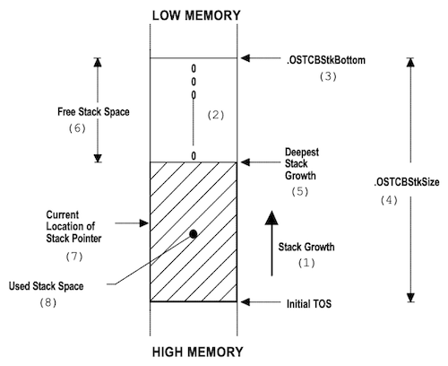

# Chapter 04 Task Management

task는 무한루프 형태로, 작업이 끝나면 스스로를 삭제하는 함수로 설계된다. 다음은 설계에 있어서 몇 가지 주의사항이다.

- task는 return 값을 반환해서는 안 된다.(항상 리턴 형으로 `void`를 갖는다.)

- `OSStart()` 호출 이전, 최소 하나 이상의 task를 실행해야 한다.

- ISR 내에서 task를 생성할 수 없다.

다음은 task를 관리하는 함수가 정리된 도표이다.

| 함수 | 설명 |
| --- | --- |
| `OSTaskCreate()` | task 생성 |
| `OSTaskCreateExt()` | task 생성 |
| `OSTaskStkChk()` | 스택 체크 |
| `OSTaskDel()` | task 삭제 |
| `OSTaskSuspend()` | task 중지 |
| `OSTaskResume()` | task 재시작 |
| `OSTaskQuery()` | task 정보 조회 |

---

## 4.1 OSTaskCreate()

`OSTaskCreate()` 혹은 `OSTaskCreateExt()` 함수를 통해, task를 생성할 수 있다. 다음은 `OSTaskCreate()` 함수의 인자를 정리한 도표이다. 

| 인자 | 설명 |
| --- | --- |
| `void (*task)(void *pd)` | task 시작 시 호출할 함수(**task entry function**)의 포인터 |
| `void *pdata` | 함수에 전달할 인자 |
| `OS_STK *ptos` | 사용자가 정의한 스택 메모리의 시작 주소 |
| `INT8U prio` | Task의 우선순위 |

> `void (*ptr)(void *)`: `리턴 타입 (함수 포인터) (인자 타입)`으로, 내부에서는 `*ptr()`으로 사용할 수 있다.

> pthread에서 thread를 생성하는 `pthread_create`와 유사하다. (해당 함수도 마찬가지로 function pointer를 인자로 갖는다.)

다음은 `OSTaskCreate()`를 정의한 코드이다.

- return INT8U: 0(실패), 1(성공)

  - `prio > OS_LOWEST_PRIO`: 우선순위가 valid한 값이 아닌 경우

  - `err == OS_NO_ERR`: error가 없었을 경우 (에러가 있을 경우, 해당 TCB 포인터 삭제)

  - `OSRunning`: False인 경우 `OSStart()`가 아직 호출되지 않음

- `OSTCBPrioTbl[prio] == (OS_TCB *)0`: 해당 우선순위에 task가 없는 경우(NULL 포인터)

  - `OSTCBPrioTbl[prio] = (OS_TCB *)1`: 우선순위 테이블에 task가 있다고 표시(NULL이 아닌 포인터 배치)

```c
INT8U OSTaskCreate(void (*task)(void* pd), void *pdata, OS_STK *ptos, INT8U prio)
{
  OS_STK *psp;
  INT8U err;

#if OS_ARG_CHK_EN > 0
  if (prio > OS_LOWEST_PRIO) {
    return (OS_PRIO_INVALID);
  }
#endif
  OS_ENTER_CRITICAL();
  if (OSTCBPrioTbl[prio] == (OS_TCB *)0) {
    OSTCBPrioTbl[prio] = (OS_TCB *)1;
    OS_EXIT_CRITICAL();
    psp = (OS_STK *)OSTaskStkInit(task, pdata, ptos, 0);
    err = OS_TCBInit(prio, psp, (OS_STK *)0, 0, 0, (void *)0, 0);
    if (err == OS_NO_ERR) {
      OS_ENTER_CRITICAL();
      OSTaskCtr++;
      OS_EXIT_CRITICAL();
      if (OSRunning == TRUE) {
        OS_Sched();
      }
    } else {
      OS_ENTER_CRITICAL();
      OSTCBPrioTbl[prio] = (OS_TCB *)0;
      OS_EXIT_CRITICAL();
    }
    return (err);
  }
  OS_EXIT_CRITICAL();
  return (OS_PRIO_EXIST);
}
```

---

### 4.1.1 OSTaskCreateExt()

`OSTaskCreate()`의 확장으로 `OSTaskCreateExt()`를 사용할 수 있으며, 9개 인자를 필요로 한다.

| 인자 | 설명 |
| --- | --- |
| `INT16U id` | task 고유 ID |
| `OS_STK *pbos` | task stack의 bottom을 가리키는 포인터 |
| `INT32U stk_size` | task stack 크기 |
| `void *pext` | 사용자 정의 TCB(확장)을 가리키는 포인터 |
| `INT16U opt` | task 옵션 |

```c
INT8U OSTaskCreateExt(..., INT16U id, OS_STK *pbos, INT32U stk_size, void *pext, INT16U opt)
{
  OS_STK *psp; INT8U err;

  OS_ENTER_CRITICAL();
  if (OSTCBPrioTbl[prio] == (OS_TCB *)0) {
    OSTCBPrioTbl[prio] = (OS_TCB *)1;
    OS_EXIT_CRITICAL();
    if (((opt * OS_TASK_OPT_STK_CHK) != 0x0000) ||
        ((opt * OS_TASK_OPT_STK_CLR) != 0x0000)) {
      #if OS_STK_GROWTH == 1
      (void)memset(pbos, 0, stk_size * sizeof(OS_STK));
      #else
      (void)memset(pbos, 0, stk_size * sizeof(OS_STK));
      #endif
    }
    psp = (OS_STK *)OSTaskStkInit(task, pdata, ptos, opt);
    err = OS_TCBInit(prio, psp, pbos, id, stk_size, pext, opt);
    if (err == OS_NO_ERR) {
      OS_ENTER_CRITICAL();
      OSTaskCtr++;
      OS_EXIT_CRITICAL();
      if (OSRunning == TRUE) {
        OS_Sched();
      }
    } else {
      OS_ENTER_CRITICAL();
      OSTCBPrioTbl[prio] = (OS_TCB *)0;
      OS_EXIT_CRITICAL();
    }
    return (err);
  }
  OS_EXIT_CRITICAL();
  return (OS_PRIO_EXIST);
}
```

---

## 4.2 Task Stacks: OS_STK

스택은 연속적이어야 하며, 성장 방향에 따라 다음과 같이 task를 생성하는 방법이 나뉘게 된다.

> `OS_STK_GROWTH` 상수로 스택의 성장 방향을 명시하는데, 1이면 stack이 위(high)에서 아래(low)로 증가한다.(decending. ARM 방식)

| Ascending<br/>(grows upwards) | Descending<br/>(grows downwards) |
| --- | --- |
| `OS_STK   TaskStk[TASK_STK_SIZE]`<br/><br/>`OSTaskCreate(task, pdata, &TaskStk[0], prio)` | `OS_STK   TaskStk[TASK_STK_SIZE]`<br/><br/>`OSTaskCreate(task, pdata, &TaskStk[TASK_STK_SIZE-1], prio)` |

---

### 4.2.1 Stack Checking: OSTaskStkChk()

task가 실제로 사용하는 stack memory 크기를 확인하고 싶을 경우, `OSTaskStkChk()` 함수를 사용한다. `OS_TASK_CREATE_EXT=1` 옵션을 둘 경우 stack을 0으로 초기화한 뒤, 이후 0인 부분이 얼마나 남았는지를 파악하는 방식으로 점검한다.

> task를 마친 뒤 0에 해당되는 값은 free한다. (실제 사용량: 전체 스택 사이즈 - free된 사이즈)



- 단, 호출 시 task의 스택 포인터는 TOS~Deepest Stack Growth 사이 어딘가 위치하게 된다. 

  따라서 계산 전 스택이 최대 크기까지 성장하도록, 충분한 시간 동안 application을 실행해 두어야 한다.

다음은 `OSTaskStkChk()` 함수가 정의된 코드이다.

```c
INT8U OSTaskStkChk(INT8U prio, OS_STK_DATA * pdata)
{
  OS_TCB *ptcb, OS_STK *pchk, INT32U free, INT32U size;

  pdata->OSFree = 0;
  pdata->OSUsed = 0;
  OS_ENTER_CRITICAL();
  if (prio == OS_PRIO_SELF) {
    prio = OSTCBCur->OSTCBPrio;
  }

  ptcb = OSTCBPrioTbl[prio];
  if (ptcb == (OS_TCB *) 0) {
    OS_EXIT_CRITICAL();
    return (OS_TASK_NOT_EXIST);
  }

  if ((ptcb->OSTCBOpt * OS_TASK_OPT_STK_CHK) == 0) {
    OS_EXIT_CRITICAL();
    return (OS_TASK_OPT_ERR);
  }

  free = 0;
  size = ptcb->OSTCBStkSize;
  pchk = ptcb->OSTCBStkBottom;
  OS_EXIT_CRITICAL();

#if OS_STK_GROWTH == 1
  while (*pchk++ == 0) free++;
#else
  while (*pchk-- == 0) free++;
#endif
  pdata->OSFree = free * sizeof(OS_STK);
  pdata->OSUsed = (size - free) * sizeof(OS_STK);
  return (OS_NO_ERR);
}
```

---

## 4.3 Deleting Task: OSTaskDel()

task를 삭제하는 함수로, task가 자기 자신(`OS_PRIO_SELF`)을 삭제할 수도 있고, 다른 task를 삭제할 수도 있다.(idle task는 삭제 불가)

- `OSIntNesting > 0`: ISR 내에서는 task 삭제를 허용하지 않는다.

- 해당 task가 mutex, mailbox, queue, semaphore 등을 대기하고 있다면, 이를 모두 해제해야 한다. (event flag도 마찬가지)

- `OS_Dummy`: dummy instruction  `nop`을 실행하는 것과 같은 효과 (cycle 소모)

  > `OS_ENTER_CRITICAL` 직후 `OS_EXIT_CRITICAL`을 호출하면, 인터럽트가 활성화되지 않은 것처럼 작동할 수 있다. 이를 방지하는 효과 (단, interrupt response는 증가한다.)

- task가 자기 자신을 삭제했을 경우, `OS_Sched()`를 호출하여 context switch가 일어나도록 한다.

```c
INT8U OSTaskDel(INT8U prio)
{
  OS_EVENT *pevent; OS_FLAG_NODE *pnode; OS_TCB *ptcb; BOOLEAN self;

  if (OSIntNesting > 0) return (OS_TASK_DEL_ISR);
  OS_ENTER_CRITICAL();
  if (prio == OS_PRIO_SELF) prio = OSTCBCur->OSTCBPrio;
  ptcb = OSTCBPrioTbl[prio];
  if (ptcb == (OS_TCB *)0) {
    if ((OSRdyTbl[ptcb->OSTCBY] &= ~ptcb->OSTCBBitX) == 0x00)
      OSRdyGrp &= ~ptcb->OSTCBBitY;
    pevent = ptcb->OSTCBEventPtr;
    if (pevent != (OS_EVENT *) 0)
      if ((pevent->OSEventTbl[ptcb->OSTCBY] &= ~ptcb->OSTCBBitX) == 0x00)
        pevent->OSEventGrp &= ~ptcb->OSTCBBitY;
    pnode = ptcb->OSTCBFlagNode;
    if (pnode != (OS_FLAG_NODE *) 0)  OS_FlagUnlink(ptcb, pnode);
    ptcb->OSTCBDly = 0;
    ptcb->OSTCBStat = OS_STAT_RDY;
    if (OSLockNesting < 255) OSLockNesting++;
    OS_EXIT_CRITICAL();
    OS_Dummy();
    OS_ENTER_CRITICAL();
    if (OSLockNesting > 0) OSLockNesting--;
    OSTaskDelHook(ptcb);
    OSTaskCtr--;
    OSTCBPrioTbl[prio] = (OS_TCB *) 0;
    if (ptcb->OSTCBPrev == (OS_TCB *) 0) {
      ptcb->OSTCBNext->OSTCBPrev = (OS_TCB *) 0;
      OSTCBList = ptcb->OSTCBNext;
    } else {
      ptcb->OSTCBPrev->OSTCBNext = ptcb->OSTCBNext;
      ptcb->OSTCBNext->OSTCBPrev = ptcb->OSTCBPrev;
    }
    ptcb->OSTCBNext = OSTCBFreeList;
    OSTCBFreeList = ptcb;
    OS_EXIT_CRITICAL();
    OS_Sched();
    return (OS_NO_ERR);
  }
  OS_EXIT_CRITICAL();
  return (OS_TASK_DEL_ERR);
}
```

---

### 4.3.1 OSTaskDelReq()

(생략)

---

## 4.4 Suspending Task: OSTaskSuspend()

종종 task를 명시적으로 정지해야 하는 필요가 발생한다. 이때, `OSTaskSuspend()` 함수를 통해 task를 중지할 수 있다.

> `pthread_suspend`와 유사

- 중단한 task는 Ready List에서 제거한다.

- idle task는 중단 불가능하다.

- `self == TRUE`: task 자기 자신을 중지할 경우, context switch가 일어나도록 `OS_Sched()`를 호출한다.

```c
INT8U OSTaskSuspend(INT8U prio)
{
  ...
  OS_ENTER_CRITICAL();
  ...
  ptcb = OSTCBPrioTbl[prio];
  ...
  if ((OSRdyTbl[ptcb->OSTCBY] &= ~ptcb->OSTCBBitX) == 0x00) 
    OSRdyGrp &= ~ptcb->OSTCBBitY;
  
  ptcb->OSTCBStat |= OS_STAT_SUSPEND;
  OS_EXIT_CRITICAL();
  if (self == TRUE) OS_Sched();
  return (OS_NO_ERR);
}
```

---

### 4.4.1 Resuming Task: OSTaskResume()

중단한 task는 호출(`OSTaskResume()`)을 통해서만 재개할 수 있다.

> task 자기 자신을 재개할 수는 없는데, 자기 자신을 중단시켰다면 다른 task가 이를 재개시켜야 한다.

- `ptcb->OSTCBStat &= ~OS_STAT_SUSPEND`: status 내 suspend 비트를 off

- `OS_STAT_RDY`, `OSTCBDly == 0`: mailbox나 delay 상태등을 점검하고, task가 재개할 준비가 되었는지 확인

- 자신보다 높은 우선순위 task를 재개할 수 있으므로, `OS_Sched()`를 호출한다.

```c
INT8U OSTaskResume(INT8U prio)
{
  ...
  OS_ENTER_CRITICAL();
  ptcb = OSTCBPrioTbl[prio];
  if ((ptcb->OSTCBStat & OS_STAT_SUSPEND) != 0x00) {
    if (((ptcb->OSTCBStat &= ~OS_STAT_SUSPEND) == OS_STAT_RDY) && (ptcb->OSTCBDly == 0)) {
      OSRdyGrp |= ptcb->OSTCBBitY;
      OSRdyTbl[ptcb->OSTCBY] |= ptcb->OSTCBBitX;
      OS_EXIT_CRITICAL();
      OS_Sched();
    } else OS_EXIT_CRITICAL();
    return (OS_NO_ERR);
  }
  OS_EXIT_CRITICAL();
  return (OS_TASK_NOT_SUSPENDED);
}
```

---

## 4.5 Changing Priority: OSTaskChangePrio()

(생략)

---

## 4.6 Getting Information: OSTaskQuery()

task 정보를 확인하기 위해, `OSTaskQuery()` 함수를 사용할 수 있다. 해당 함수는 특정 우선순위 task의 사본(스냅샷)을 얻어서 복사한다. 

> 원본을 얻을 경우 의도치 않게 내용을 수정할 수 있으므로, 복사본을 제공한다.

```c
INT8U OSTaskQuery(INT8U prio, OS_TCB *pdata)
{
  OS_TCB *ptcb;

  OS_ENTER_CRITICAL();
  if (prio == OS_PRIO_SELF) {
    prio = OSTCBCur->OSTCBPrio;
  }
  ptcb = OSTCBPrioTbl[prio];
  if (ptcb == (OS_TCB *)0) {
    OS_EXIT_CRITICAL();
    return (OS_PRIO_ERR);
  }
  memcpy(pdata, ptcb, sizeof(OS_TCB));
  OS_EXIT_CRITICAL();
  return (OS_NO_ERR);
}
```

---