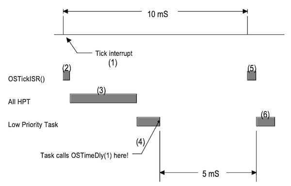

# Chapter 05 Time Management

시간 지연 및 타임아웃 기능를 위해서는 주기적인 타임 인터럽트가 발생해야 한다. 다음은 시간 관리 서비스를 제공하는 함수와, 이를 활성화하는 변수(`OS_CFG.H`에서 설정)를 나타낸 도표이다.

| Time Management Service | 옵션(1 설정 시 활성화) |
| --- | --- |
| `OSTimeDly()` | |
| `OSTimeDlyHMSM()` | `OS_TIME_DLY_HMSM_EN` |
| `OSTimeDlyResume()` | `OS_TIME_DLY_RESUME_EN` |
| `OSTimeGet()` | `OS_TIME_GET_SET_EN` |
| `OSTimeSet()` | `OS_TIME_GET_SET_EN` |

---

## 5.1 Delaying a Task: OSTimeDly()

`OSTimeDly()` 함수를 이용해, task를 사용자가 전달한 tick(1~65536)만큼 지연시킬 수 있다. (TCB 내 `OSTCBDly`에 delay tick 기록)

- 해당 task는 Task Ready 상태로 전환된다.
 
  동시에, context switching을 수행하고, 우선순위가 높은 다른 task를 수행하게 된다.

- `TickISR`에 따라서 delay가 0이 되거나, `OSTimeDlyResume()`을 통해 명시할 경우, Task Ready 상태로 다시 전환된다.

```c
void OSTimeDly (INT16U ticks)
{
    if (ticks > 0) {
        OS_ENTER_CRITICAL();
        if ((OSRdyTbl[OSTCBCur->OSTCBY] &= ~OSTCBCur->OSTCBBitX) == 0) {
            OSRdyGrp &= ~OSTCBCur->OSTCBBitY;
        }
        OSTCBCur->OSTCBDly = ticks;
        OS_EXIT_CRITICAL();
        OS_Sched();
    }
}
```

단, delay는 정확하게 작동하지 않는다. (부하를 고려하지 않는다면) 1 tick만 지연하도록 설정해도, 대체로 그 사이 0~1 사이 값 만큼 delay된다.

> 2.12.1절 Clock Tick 참조

다음은 1 tick 지연 시 동작을 나타낸 도표이다. 1 tick(20ms 설정)보다 훨씬 적은 5ms만 지연된다.

> notation: HPT(High-Priority Task), LPT(Low-Priority Task)



| 순서 | 설명 |
| :---: | --- |
| (1) | 10 ms 마다 tick interrupt 발생 |
| (2) | (다른 인터럽트는 서비스하지 않는다고 가정) `OSTickISR()` 호출 |
| (3) | 우선순위가 높은 task(HPT) 수행 |
| (4) | LPT에서 `OSTimeDly(1)` 호출 |
| (5) & (6) | 다음 tick에서 `TickISR`이 실행되나, HPT가 존재하지 않는다.<br/>따라서, (4)의 LPT를 실행한다. |

---

### 5.1.1 OSTimeDlyHMSM()

tick 대신, `OSTimeDlyHMSM()` 함수를 사용하여 시간, 분, 초, 밀리초 단위로 지연시킬 수 있다.

```c
INT8U OSTimeDlyHMSM(INT8U hours, INT8U minutes, INT8U seconds, INT16U milli)
{
    INT32U ticks, INT16U loops;

    if (hours > 0 || minutes > 0 || seconds > 0 || milli > 0) {
        ...
        ticks = ((INT32U)hours * 3600L + (INT32U)minutes * 60L + (INT32U)seconds) * OS_TICKS_PER_SEC + OS_TICKS_PER_SEC * ((INT32U)milli + 500L / OS_TICKS_PER_SEC) / 1000L;
        loops = (INT16U)(ticks / 65536L);
        ticks = ticks % 65536L;
        OSTimeDly((INT16U)ticks);
        while (loops > 0) {
            OSTimeDly(32768);
            OSTimeDly(32768);
            loops--;
        }
        return (OS_NO_ERR);
    }
    return (OS_TIME_ZERO_DLY);
}
```

---

## 5.2 Resuming a Delayed Task: OSTimeDlyResume()

`OSTimeDlyResume()` 함수를 사용하여, 지연된 task를 다시 Task Ready 상태로 전환시킬 수 있다.

- `OS_TCB` 필드에 0이 아닌 값이 존재할 경우, 해당 task는 delay 상태이다.

  > `OSTimeDly()`, `OSTimeDlyHMSM()`, 기타 PEND 함수에 의해 delay

> `OSTCBStat`: 3.4.3절 OSTCBStat 참조

```c
INT8U OSTimeDlyResume (INT8U prio)
{
    OS_TCB *ptcb;
    ...
    OS_ENTER_CRITICAL();
    ptcb = (OS_TCB *)OSTCBPrioTlb[prio];
    if (ptcb != (OS_TCB *)0) {
        if (ptcb->OSTCBDly != 0) {
            ptcb->OSTCBDly = 0;
            if ((ptcb->OSTCBStat & OS_STAT_SUSPEND) == OS_STAT_RDY) {
                OSRdyGrp |= ptcb->OSTCBBitY;
                OSRdyTbl[ptcb->OSTCBY] |= ptcb->OSTCBBitX;
                OS_EXIT_CRITICAL();
                OS_Sched();
            } else {
                OS_EXIT_CRITICAL();
            }
            return (OS_NO_ERR);
        } else {
            OS_EXIT_CRITICAL();
            return (OS_TIME_NOT_DLY);
        }
    }
    OS_EXIT_CRITICAL();
    return (OS_TASK_NOT_EXIST);
}
```

---

## 5.3 System Time: OSTimeGet, OSTimeSet

clock tick이 발생할 때마다, uC/OS-II는 32 bit 카운터(~4,294,967,295)를 증가시킨다. 

- `OSTimeGet()`: 카운터 값 조회.

- `OSTimeSet()`: 카운터 값 변경

```c
INT32U OSTimeGet (void)
{
#if OS_CRITICAL_METHOD == 3
    OS_CPU_SR cpu_sr;
#endif
    INT32U ticks;

    OS_ENTER_CRITICAL();
    ticks = OSTime;
    OS_EXIT_CRITICAL();
    return (ticks);
}
```

```c
void OSTimeSet (INT32U ticks)
{
#if OS_CRITICAL_METHOD == 3
    OS_CPU_SR cpu_sr;
#endif
    
    OS_ENTER_CRITICAL();
    OSTime = ticks;
    OS_EXIT_CRITICAL();
}
```

---