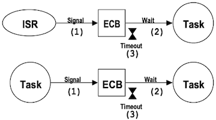
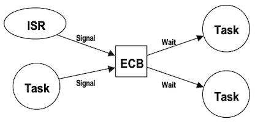
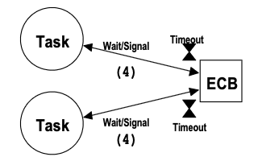
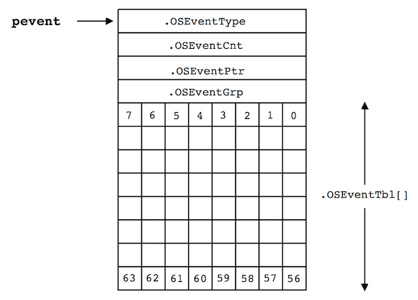
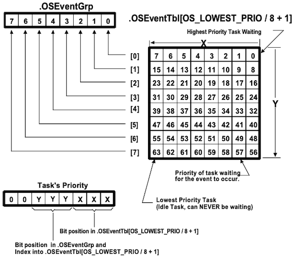
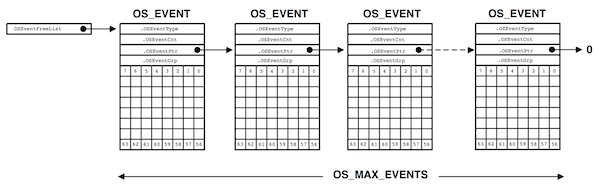

# Chapter 06 Event Control Blocks

---

## 6.1 Use of Event Control Blocks

Task 및 ISR은 **Event Control Block**(ECB)이라는 커널 개체를 사용하여 task와 통신한다.

- semaphore, mailbox, message queue 등 구현을 위해 사용된다.

- ISR은 ECB 신호를 대기할 수 없다.

- 신호를 수신받을 경우, ECB를 대기 중인 task 중 **가장 높은 task만 신호를 받아서 Task Ready로 전환**된다.

| A: ISR 혹은 task에서 ECB에 신호 전달 | B: 여러 task가 신호를 보내고, 동시에 여러 task에서 수신 | C: ECB를 semaphore로 활용 |
| :---: | :---: | :---: |
|  |  |  |

---

## 6.2 Event Control Blocks

다음은 ECB 구조체를 나타낸 도식이다.

| 필드 | 설명 |
| --- | --- |
| `OSEventType` | ECB가 어떤 목적으로 사용되는지 표시 |
| `OSEventCnt` | semaphore 혹은 mutex 카운터 |
| `OSEventPtr` | mailbox 혹은 message queue 할당 시 사용<br/>(메시지를 가리키는 포인터) |
| `OSEventGrp` | 이벤트를 대기 중인 task 우선순위 그룹 |
| `OSEventTbl[OS_EVENT_TBL_SIZE]` | 이벤트를 대기 중인 task 우선순위 그룹 테이블 |

> `OSEventGrp`, `OSEventTbl`: `OSRdyGrp`, `OSRdyTbl`과 유사하며, (Task Ready 중인 task 대신) 이벤트를 기다리는 task를 기록하는 데 사용된다.



```c
typedef struct {
  INT8U OSEventType;
  INT8U OSEventGrp;
  INT16U OSEventCnt;
  void *OSEventPtr;
  INT8U OSEventTbl[OS_EVENT_TBL_SIZE];
} OS_EVENT;
```

다음은 `OSEventType`을 정의한 예시다.

```c
#define  OS_EVENT_TYPE_UNUSED      0		/* All possible values for OSEventType in OS_EVENT struct */
#define  OS_EVENT_TYPE_MBOX        1    /* Mailbox */
#define  OS_EVENT_TYPE_Q           2    /* Message queue */
#define  OS_EVENT_TYPE_SEM         3    /* Semaphore */
#define  OS_EVENT_TYPE_MUTEX       4    /* Mutex */
#define  OS_EVENT_TYPE_FLAG        5
```

---

### 6.2.1 ECB Wait List

다음은 ECB의 대기 리스트를 나타낸 도식이다.



```c
pevent->OSEventGrp            |= OSMapTbl[prio >> 3];
pevent->OSEventTbl[prio >> 3] |= OSMapTbl[prio & 0x07];
```

| operation | 코드 | 설명 |
| --- | --- | --- |
| Event 대기 상태로 전환 | `pevent->OSEventGrp    \|= OSMapTbl[prio >> 3];`<br/>`pevent->OSEventTbl[prio >> 3]   \|= OSMapTbl[prio & 0x07];` | `OSEventGrp   \|= BitY`<br/>`OSEventTbl[Y] \|= BitX` |
| ECB Wait List에서 제거 | `if ((pevent->OSEventTbl[prio >> 3] &= ~OSMapTbl[prio & 0x07]) == 0)`<br/> $\quad$ `pevent->OSEventGrp &= ~OSMapTbl[prio >> 3];` | `if((OSEventTbl[Y] &= ~BitX) == 0)`<br/> $\quad$ `OSEventGrp &= ~BitY` |
| 최고 우선순위 대기 task 조회 | `y = OSUnMapTbl[pevent->OSEventGrp];`<br/>`x = OSUnMapTbl[pevent->OSEventTbl[y]];`<br/>`prio = (y << 3) + x;` | `y = OSEventGrp` 대응<br/>`x = OSEventTbl[y]` 대응 |

---

### 6.2.2 List of Free ECBs

ECB는 linked list 형태로 관리된다. 

- `OS_MAS_EVENTS`에 값을 할당하여 크기를 지정할 수 있다.

- 목적(세마포어, 뮤텍스, 메일박스, 큐)에 따라 `OS{...}Del()` 함수를 호출하여 반환한다.



---

### 6.2.3 Initializing an ECB: OS_EventWaitListInit()

ECB를 초기화하기 위해 커널에서 내부적으로 `OS_EventWaitListInit()` 함수를 호출한다.

- `ptbl`: `OSEventTbl`의 시작 주소(첫 번째 entry)를 가리킨다.

```c
void OS_EventWaitListInit (OS_EVENT *pevent)
{
  INT8U *ptbl;

  pevent->OSEventGrp = 0x00;
  ptbl               = &pevent->OSEventTbl[0];

#if OS_EVENT_TBL_SIZE > 0
  *ptbl++ = 0x00;                           /* Clear the wait list table */
#endif
...
#if OS_EVENT_TBL_SIZE > 7
  *ptbl++ = 0x00;
#endif
}
```

---

## 6.3 Making a Task Ready: OS_EventTaskRdy()

ECB가 신호를 받으면, 대기 중인 최상위 우선순위 task를 Task Ready 상태로 전환해야 한다. 이때, 커널에서 내부적으로 `OS_EventTaskRdy()` 함수를 사용한다.

> 세마포어, 뮤텍스, 메일박스, 메시지 큐의 `POST` 함수에서 호출된다.

- ECB wait list에서 최고 우선순위 Task를 제거한다.

- `*msg`: mailbox일 경우, task에게 메세지 주소를 전달

- `msk`: `OSTCBStat`을 수정하기 위한 bit mask

- 우선순위 값을 반환한다.

```c
INT8U OS_EventTaskRdy (OS_EVENT *pevent, void *msg, INT8U msk)
{
  OS_TCB *ptcb; INT8U x; INT8U y; INT8U bitx; INT8U bity; INT8U prio;

  y = OSUnMapTbl[pevent->OSEventGrp];       /* Find HPT waiting for message */
  bity = OSMapTbl[y];
  x = OSUnMapTbl[pevent->OSEventTbl[y]];
  bitx = OSMapTbl[x];
  prio = (INT8U) ((y << 3) +  x);
  if ((pevent->OSEventTbl[y] &= ~bitx) == 0x00) {
    pevent->OSEventGrp &= ~bity;
  }
  ptcb                 = OSTCBPrioTbl[prio];
  ptcb->OSTCBEventPtr  = (OS_EVENT *)0;
  ptcb->OSTCBMsg       = msg;
  ptcb->OSTCBStat     &= ~msk;
  if (ptcb->OSTCBStat == OS_STAT_RDY) {
    OSRdyGrp    |= bity;
    OSRdyTbl[y] |= bitx;
  }
  return (prio);
}
```

---

## 6.4 Making a Task Wait: OS_EventTaskWait()

반대로 `OS_EventTaskWait()` 함수는, Task Ready 상태인 task를 중단하고 wait list에 추가한다. 

> 세마포어, 뮤텍스, 메일박스, 메시지 큐의 `PEND` 함수에서 호출된다.

- `OSTCBCur` 내 `OSTCBEventPtr`에 ECB 주소를 전달한다.

- Ready List에서 task를 제거하고, ECB wait list에 추가한다.

```c
void OS_EventTaskWait (OS_EVENT *pevent)
{
  OSTCBCur->OSTCBEventPtr = pevent;
  if ((OSRdyTbl[OSTCBCur->OSTCBY] &= ~OSTCBCur->OSTCBBitX) == 0x00) {
    OSRdyGrp &= ~OSTCBCur->OSTCBBitY;
  }
  pevent->OSEventTbl[OSTCBCur->OSTCBY] |= OSTCBCur->OSTCBBitX;
  pevent->OSEventGrp                   |= OSTCBCur->OSTCBBitY;
}
```

---

## 6.5 Task Ready Because of Timeout: OS_EventTO()

`OS_EventTaskRdy()`와 달리 timeout이 발생했을 경우 호출된다.

> 세마포어, 뮤텍스, 메일박스, 메시지 큐의 `PEND` 함수에서, timeout 시간까지 신호를 못 받았을 경우 호출된다.

- 시간 제어 함수에 의해, `OS_EventTO()` 호출 시점에서는 이미 Task Ready 상태로 변경되어 있으므로 주의해야 한다.

- OSEventTbl에서 해당 task를 제거한다.

```c
void OS_EventTO (OS_EVENT *pevent)
{
  if ((pevent->OSEventTbl[OSTCBCur->OSTCBY] &= ~OSTCBCur->OSTCBBitX) == 0x00) {
    pevent->OSEventGrp &= ~OSTCBCur->OSTCBBitY;
  }
  OSTCBCur->OSTCBStat      = OS_STAT_RDY;
  OSTCBCur->OSTCBStatPend  = (OS_EVENT *)0;
}
```

---