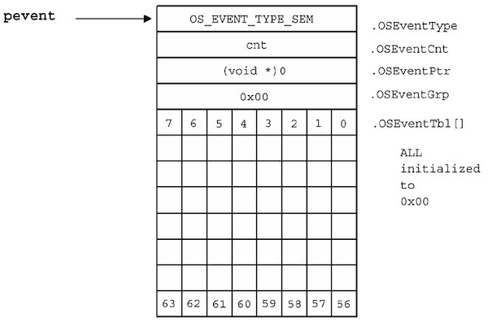

# Chapter 07 Semaphore Management

세마포어는 세마포어 수를 세는 INT16U 카운터(0~65535)와, 대기 중인 task를 위한 wait list를 가지고 있다. 다음은 세마포어 관리 서비스를 제공하는 함수와, 이를 활성화하는 변수(`OS_CFG.H`에서 설정)를 나타낸 도표이다.

| Semaphore Management Service | 설명 | 옵션(1 설정 시 활성화) |
| --- | --- | --- |
| `OSSemAccept()` | 대기 없이 세마포어 획득(non-blocking) | `OS_SEM_ACCEPT_EN` |
| `OSSemCreate()` | 세마포어 생성 | |
| `OSSemDel()` | 세마포어 삭제 | `OS_SEM_DEL_EN` |
| `OSSemPend()` | 세마포어 대기 | |
| `OSSemPost()` | 세마포어 신호 전달 | |
| `OSSemQuery()` | 세마포어 상태 정보 획득 | `OS_SEM_QUERY_EN` |

---

## 7.1 Relationship between Task, ISR, and Semaphore

다음은 task, ISR과 세마포어 간의 관계를 나타낸 도식이다.

> 세마포어는 열쇠, 혹은 깃발 기호(이벤트 발생을 알리기 위해 사용할 경우)로 표시한다.

- $N$ : 사용 가능한 리소스 수
  
  - 이진 세마포어(mutex)의 경우, $N=1$

- ISR에서는 세마포어를 생성(`OSSemCreate()`)하거나 삭제(`OSSemDel()`)할 수 없다. 또한, 세마포어를 대기(`OSSemPend()`)할 수 없다.


---

## 7.2 Creating Semaphore: OSSemCreate()

다음은 세마포어를 생성하는 `OSSemCreate()` 함수이다.

- `OSIntNesting > 0`: ISR에서는 세마포어를 생성할 수 없다.

- `OSEventFreeList`에서 ECB를 가져와서 초기화하고, 해당 ECB를 반환한다.

  - `OS_EventWaitListInit()`함수  호출하여 초기화

- `OSEventCnt`: 1일 경우 binary semaphore

- `!= (OS_EVENT *)0`: 유효성(NULL) 검사

```c
OS_EVENT *OSSemCreate(INT16 cnt)
{
  OS_EVENT *pevent;

  if (OSIntNesting > 0) return ((OS_EVENT *)0);
  OS_ENTER_CRITICAL();
  pevent = OSEventFreeList;
  if (OSEventFreeList != (OS_EVENT *)0) {
    OSEventFreeList = (OS_EVENT *)OSEventFreeList->OSEventPtr;
  }
  OS_EXIT_CRITICAL();
  if (pevent != (OS_EVENT *)0) {
    pevent->OSEventType = OS_EVENT_TYPE_SEM;
    pevent->OSEventCnt  = cnt;
    pevent->OSEventPtr  = (void *)0;
    OS_EventWaitListInit(pevent);
  }
  return (pevent);
}
```

다음은 `OSSemCreate()` 함수가 초기화 후 반환한 ECB를 나타낸 도식이다.



---

## 7.3 Deleting Semaphore: OSSemDel()

다음은 세마포어를 삭제하는 `OSSemDel()` 함수이다. 삭제 이전에, 먼저 세마포어에 접근하는 모든 task부터 삭제해야 한다.

- `tasks_waiting`: 대기 중인 task가 있다면 TRUE, 없다면 FALSE

- `OSEventFreeList`에 ECB를 반납한다.

  - `OSEventType = OS_EVENT_TYPE_UNUSED`: ECB를 사용되지 않은 것으로 표기

- 인자 `opt`에 따라 다르게 실행된다.

  - `opt = OS_DEL_NO_PEND`: pending task가 없을 때만 삭제

  - `opt=OS_DEL_ALWAYS`: 세마포어를 대기 중인 모든 작업을 Task Ready 상태로 전환하고, 더 높은 우선순위 task가 깨어날 수 있으므로 `OS_Sched()`를 호출한다.

```c
OS_EVENT *OSSemDel (OS_EVENT *pevent, INT8U opt, INT8U *err)
{
  BOOLEAN tasks_waiting;
  ...
  OS_ENTER_CRITICAL();
  if (pevent->OSEventGrp != 0x00) tasks_waiting = TRUE;
  else tasks_waiting = FALSE;
  switch (opt) {
    case OS_DEL_NO_PEND:
      if (tasks_waiting == FALSE) {
        pevent->OSEventType = OS_EVENT_TYPE_UNUSED;
        pevent->OSEventPtr  = OSEventFreeList;
        OSEventFreeList     = pevent;
        OS_EXIT_CRITICAL();
        *err = OS_NO_ERR;
        req
      } else {
        OS_EXIT_CRITICAL();
        *err = OS_ERR_TASK_WAITING;
        return (pevent);
      }
    csae OS_DEL_ALWAYS:
      while (pevent->OSEventGrp != 0x00) {
        OS_EventTaskRdy(pevent, (void *)0, OS_STAT_SEM);
      }
      pevent->OSEventType = OS_EVENT_TYPE_UNUSED;
      pevent->OSEventPtr  = OSEventFreeList;
      OSEventFreeList     = pevent;
      OS_EXIT_CRITICAL();
      if (tasks_waiting == TRUE) OS_Sched();
      *err = OS_NO_ERR;
      return ((OS_EVENT *)0);
    default:
      OS_EXIT_CRITICAL();
      *err = OS_ERR_OPT_INVALID;
      return (pevent);
  }
}
```

---

## 7.4 Waiting on Semaphore (Blocking): OSSemPend()

현재 task가 세마포어를 획득할 수 없다면, 세마포어 대기 상태로 전환한다. 이때, `OSSemPend()` 함수를 사용한다.

- `OSEventCnt > 0`: 카운트가 0보다 크면 1 감소시키고 return한다.

- Task Ready 상태로 전환(`OSTCBStat |= OS_STAT_SEM`)하고, `OS_Sched()`를 호출하여 context switching한다.

- `(OSTCBStat & OS_STAT_SEM)`: 만약 세마포어 대기 상태로 task가 재개되었다면, timeout으로 깨어난 것이다.

  > 에러로 `OS_TIMEOUT`을 반환한다.

```c
void OSSemPend (OS_EVENT *pevent, INT16U timeout, INT8U *err) {
  OS_ENTER_CRITICAL();
  if (pevent->OSEventCnt > 0) {
    pevent->OSEventCnt--;
    OS_EXIT_CRITICAL();
    *err = OS_NO_ERR;
    return;
  }
  OSTCBCur->OSTCBStat |= OS_STAT_SEM;
  OSTCBCur->OSTCBDly   = timeout;
  OS_EventTaskWait(pevent);
  OS_EXIT_CRITICAL();
  OS_Sched();
  OS_ENTER_CRITICAL();
  if (OSTCBCur->OSTCBStat & OS_STAT_SEM) {
    OS_EventTO(pevent);
    OS_EXIT_CRITICAL();
    *err = OS_TIMEOUT;
    return;
  }
  OSTCBCur->OSTCBEventPtr = (OS_EVENT *)0;
  OS_EXIT_CRITICAL();
  *err = OS_NO_ERR;
}
```

---

## 7.5 Signaling Semaphore: OSSemPost

`OSSemPost()` 함수는 신호를 보내, 세마포어를 획득한 task를 깨우는 역할을 수행한다.

- `OSEventGrp != 0x00`: ECB wait list가 비어있는지 확인 후, `OS_EventTaskRdy()`를 호출하여 대기 중인 task를 깨운다.

  > `OS_EventTaskRdy()` 내부에서 `OSEventCnt`를 증가시키므로, 여기서는 증가시킬 필요가 없다.
  
- 반면, 깨어줄 task가 없다면, `OSEventCnt`를 1 증가시킨다.

- `OS_SEM_OVF`: 오버플로 발생

```c
INT8U OSSemPost (OS_EVENT *pevent)
{
    OS_ENTER_CRITICAL();
    if (pevent->OSEventGrp != 0x00) {
        OS_EventTaskRdy(pevent, (void *)0, OS_STAT_SEM);
        OS_EXIT_CRITICAL();
        OS_Sched();
        return (OS_NO_ERR);
    } 
    if (pevent->OSEventCnt < 65535) {
        pevent->OSEventCnt++;
        OS_EXIT_CRITICAL();
        return (OS_NO_ERR);
    }
    OS_EXIT_CRITICAL();
    return (OS_SEM_OVF);
}
```

---

## 7.6 Getting Semaphore without Wating(Non-blocking): OSSemAccept()

`OSSemAccept()` 함수는 대기 없이 세마포어를 획득하는 함수이다.

- `cnt`를 반환한다.

  - `cnt > 0`: 1 감소시키고 반환
  
  - otherwise: 그대로 반환한다.

```c
INT16U OSSemAccept (OS_EVENT *pevent)
{
    OS_ENTER_CRITICAL();
    cnt = pevent->OSEventCnt;
    if (cnt > 0) {
        pevent->OSEventCnt--;
    }
    OS_EXIT_CRITICAL();
    return (cnt);
}
```

---