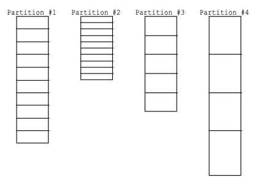
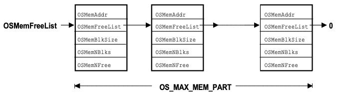
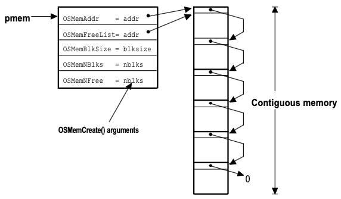

# Chapter 08 Memory Management

---

## 8.1 Memory Management

소프트웨어가 작동에 있어서 동적 메모리를 필요로 할 수 있다. 하지만, 귀중한 자원인 메모리 관리에 있어서, 다음 문제를 주의해야 한다.

- (-) C의 `malloc`, `free`를 통해 불규칙한 메모리 크기 할당을 반복할 경우, **memory fragmentation** 문제에 취약하다.

  > 할당 크기가 가변적인 까닭에, 예를 들어 `malloc`으로 만약 32 bytes보다 큰 공간이 필요하면, 여유 메모리를 찾을 때까지 탐색(first fit)이 필요하다.

  > 대안으로 만족하면서 가장 작은 공간을 탐색하는 알고리즘(best fit)이 있으나, 탐색 지연시간이 늘어난다.

- (-) 목적이 RTOS인 경우, `malloc`이나 `free`가 가진 non-deterministic한 성질이 바람직하지 않다. (linked list 특성상)

따라서, uC/OS-II에서는, 다양한 고정 크기의 블록(Partition)을 두는 방식으로 동적 메모리를 관리한다.



- 각 partition마다 하나의 **Memory Control Block**(MCB)를 갖는다.

  > `OSInit()` 내에서 호출하는 `OSMEMInit()` 함수에서 초기화된다.

> 기능을 사용하기 위해서는, `os_cfg.h` 파일 내부에서 `OS_MEM_EN = 1`로 설정해야 한다.

---

### 8.1.1 Memory Control Block

각 memory partition마다 소유한 `OS_MCB` 구조체는, 다음과 같은 변수를 
갖는다.



| 변수 | 설명 |
| --- | --- |
| `OSMemAddr` | partition 시작 주소 |
| `OSMemFreeList` | 다음 free block 혹은 free list |
| `OSMemBlkSize` | 파티션 크기 |
| `OSMemNBlks` | 파티션이 갖는 블록 개수 |
| `OSMemNFree` | 남은 free 블록 개수 |

다음은 `OS_MCB` 구조체를 정의한 코드이다.

```c
typedef struct {
  void  *OSMemAddr;     /* Partition base address */
  void  *OSMemFreeList; /* Pointer to list of free blocks */
  INT32U OSMemBlkSize;  /* Size (in bytes) of each block */
  INT32U OSMemNBlks;    /* Number of blocks in the partition */
  INT32U OSMemNFree;    /* Number of memory blocks remaining */
} OS_MEM;
```

---

## 8.2 Creating Memory Partition: OSMemCreate

다음은 memory partition을 생성하는 `OSMemCreate()` 함수가 전달받는 인자이다.

| 인자 | 설명 |
| --- | --- |
| `addr` | partition 메모리 영역(MCB)의 시작 주소 포인터 |
| `nblks` | partition이 갖는 블록 개수 |
| `blksize` | 각 블록의 크기 |
| `err` | 에러 주소 |

> `INT8U CommTxPart[100][32]`: 32 bytes 블록 100개

```c
OS_MEM *CommTxBuf;
INT8U   CommTXPart[100][32];

void main(void)
{
  INT8U err;

  OSInit();
  ...
  CommTxBuffer = OSMemCreate(CommTXPart, 100, 32, &err);
  ...
  OSStart();
}
```

다음은 memory partition을 생성하는 `OSMemCreate()` 함수이다.

- `OSMemFreeList != (OS_MEM *0)0`: free list가 존재하는지 확인

- for loop를 돌며 linked list를 생성한다. 

  - `*plink = (void *)0;`: 가장 마지막 NULL pointer


```c
OS_MEM *OSMemCreate (void *addr, INT32U nblks, INT32U blksize, INT8U *err)
{
  OS_MEM *pmem;
  INT8U *pblk;
  void **plink;
  INT32U i;

  OS_ENTER_CRITICAL();
  pmem = OSMemFreeList;
  if (OSMemFreeList != (OS_MEM *)0) {
    OSMemFreeList = (OS_MEM *)OSMemFreeList->OSMemFreeList;
  }
  OS_EXIT_CRITICAL();
  if (pmem == (OS_MEM *)0) {
    *err = OS_ERR_MEM_NO_FREE_BLKS;
    return ((OS_MEM *)0);
  }
  plink = (void **)addr; /* Create linked list of free blocks */
  pblk = (INT8U *)addr + blksize;
  for (i = 0; i < nblks; i++) {
    *plink = pblk;
    plink = (void **)pblk;
    pblk += blksize;
  }
  *plink = (void *)0;
  pmem->OSMemAddr = addr;
  pmem->OSMemFreeList = addr;
  pmem->OSMemBlkSize = blksize;
  pmem->OSMemNBlks = nblks;
  pmem->OSMemNFree = nblks;
  *err = OS_NO_ERR;
  return (pmem);
}
```

다음은 `OSMemCreate()` 함수를 통해 생성된 memory partition을 나타낸 그림이다.




---

## 8.3 Obtaining Memory Block: OSMemGet()

생성된 memory partition에서, free block을 할당 받는 함수이다.

- 이때, `OSMemCreate()`에서 반환한 포인터를 인자(`pmem`)로 전달해야 한다.

```c
void *OSMemGet (OS_MEM *pmem, INT8U *err)
{
  void  *pblk;

  OS_ENTER_CRITICAL();
  if (pmem->OSMemNFree > 0) {
    pblk = pmem->OSMemFreeList;
    pmem->OSMemFreeList = *(void **)pblk;
    pmem->OSMemNFree--;
    OS_EXIT_CRITICAL();
    *err = OS_NO_ERR;
    return (pblk);
  }
  OS_EXIT_CRITICAL();
  *err = OS_ERR_MEM_NO_FREE_BLKS;
  return ((void *)0);
}
```

---

## 8.4 Returning Memory Block: OSMemPut()

사용을 마친 후 `OSMemPut()` 함수를 통해 블록을 반납할 수 있다. 이때 주의할 점으로, 반드시 해당 메모리 블록을 올바른 memory partition에 반납해야 한다.

- `*pblk`: 반납하려는 메모리 블록 주소

- `(OSMemNFree >= OSMemNBlks)`: 메모리 파티션이 가득 찼는지 확인하여, 할당 및 반납이 정상적으로 이루어졌는지 검증

> `OSMemFreeList`가 반납하는 메모리 블록을 가리키고, 해당 블록은 free list의 다음 블록을 가리키게 된다. 때문에, 링크드 리스트가 초기화 시 순서와 점차 달라지게 된다.

```c
INT8U OSMemPut (OS_MEM *pmem, void *pblk)
{
  OS_ENTER_CRITICAL();
  if (pmem->OSMemNFree >= pmem->OSMemNBlks) {
    OS_EXIT_CRITICAL();
    return (OS_ERR_MEM_FULL);
  }
  *(void **)pblk = pmem->OSMemFreeList;     /* Insert released block into free block list. */ 
  pmem->OSMemFreeList = pblk;           /* Point to the new head of the list. */
  pmem->OSMemNFree++;                /* One more free memory block */
  OS_EXIT_CRITICAL();
  return (OS_NO_ERR);
}
```

---

## 8.5 Obtaining Status of Memory Partition: OSMemQuery

`OSMemQuery()` 함수를 통해 memory partition의 상태를 조회할 수 있다.

> 사용 가능한 블록 수, 할당된 블록 수, 각 메모리 블록의 크기 등을 확인할 수 있다.

```c
INT8U OSMemQuery (OS_MEM *pmem, OS_MEM_DATA *pdata)
{
  ...
}

typedef struct {
  void   *OSAddr;       /* Memory partition base address */
  void   *OSFreeList;   /* Pointer to list of free blocks */
  INT32U OSBlkSize;     /* Size of each block */
  INT32U OSNBlks;       /* Number of blocks in the partition */
  INT32U OSNFree;       /* Number of memory blocks remaining */
  INT32U OSNUsed;       /* Number of memory blocks used */
} OS_MEM_DATA;
```

---